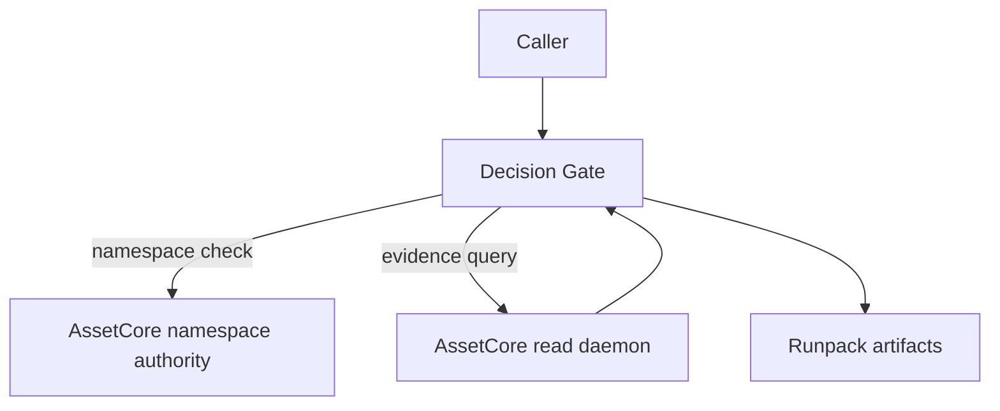

<!--
Docs/integrations/assetcore/README.md
============================================================================
Document: DG + AssetCore Integration Hub
Description: Canonical entry point for DG/ASC overlap and positioning.
Purpose: Explain how DG integrates with ASC without implying dependency.
Dependencies:
  - ../architecture/decision_gate_assetcore_integration_contract.md
  - ../guides/assetcore_interop_runbook.md
============================================================================
-->

# Decision Gate + AssetCore Integration

**Tagline**: DG evaluates requirements. ASC provides the world-state substrate
for deterministic evidence.

**Compatibility**: Compatible with AssetCore.

**AssetCore overview**: [assetcore.io/asset-core](https://assetcore.io/asset-core).

**Work in progress**: This hub is the focal point for testing external provider
integrations and remains an open work in progress. See
[F:Docs/roadmap/README.md L73-L81](../../roadmap/README.md#L73-L81) for the
current OSS launch plan and status.

## Table of Contents

- [Positioning](#positioning)
- [Integration Boundaries](#integration-boundaries)
- [Data Flow](#data-flow)
- [When to Use ASC](#when-to-use-asc)
- [Starting Points](#starting-points)
- [References](#references)

## Positioning

- **Decision Gate**: deterministic checkpoint and requirement-evaluation control
  plane.
- **AssetCore**: deterministic structured memory substrate for explicit world
  state (0d - 2d, 3d planned), replayable transactions, and namespace-backed proofs.
- **Integration**: optional and explicit; no code coupling between repos.

## Integration Boundaries

- DG remains authoritative for scenarios, gates, decisions, and runpacks.
- ASC remains authoritative for world-state and namespace validity.
- Auth tokens from ASC are not parsed by DG; an integration layer maps
  principals to DG tool permissions.

## Data Flow

## When to Use ASC

Use DG with ASC when:

- Evidence must be replayable against a deterministic world-state snapshot.
- Namespace authority must be enforced by a system of record.
- Auditable anchors must reference ASC commit or sequence metadata.

Use DG without ASC when:

- Evidence comes from local artifacts or non-ASC services.
- A lightweight gating layer is sufficient.

## Starting Points

- Contract:
  [F:Docs/architecture/decision_gate_assetcore_integration_contract.md L13-L155](../../architecture/decision_gate_assetcore_integration_contract.md#L13-L155)
- Architecture diagrams:
  [F:Docs/integrations/assetcore/architecture.md L12-L68](architecture.md#L12-L68)
- Integration examples:
  [F:Docs/integrations/assetcore/examples.md L10-L20](examples.md#L10-L20)
- Interop runbook:
  [F:Docs/guides/assetcore_interop_runbook.md L14-L189](../../guides/assetcore_interop_runbook.md#L14-L189)

## References

- [F:Docs/architecture/decision_gate_assetcore_integration_contract.md L13-L155](../../architecture/decision_gate_assetcore_integration_contract.md#L13-L155)
- [F:Docs/integrations/assetcore/architecture.md L12-L68](architecture.md#L12-L68)
- [F:Docs/integrations/assetcore/deployment.md L12-L31](deployment.md#L12-L31)
- [F:Docs/integrations/assetcore/examples.md L10-L20](examples.md#L10-L20)
- [F:Docs/guides/assetcore_interop_runbook.md L14-L189](../../guides/assetcore_interop_runbook.md#L14-L189)
