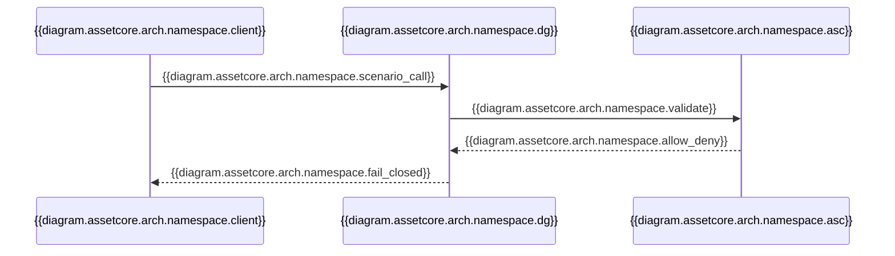
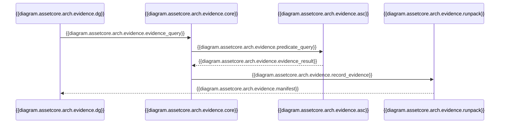

<!--
Docs/integrations/assetcore/architecture.md
============================================================================
Document: DG + AssetCore Integration Architecture
Description: Architecture and data flow for DG/ASC alignment.
Purpose: Provide crisp, implementation-ready diagrams and flow.
Dependencies:
  - Docs/architecture/decision_gate_assetcore_integration_contract.md
============================================================================
-->

# DG + AssetCore Architecture

## High-Level Topology
```mermaid
%% alt: {{diagram.assetcore.arch.topology.alt}}
flowchart TB
  Client[{{diagram.assetcore.arch.topology.client}}] -->|{{diagram.assetcore.arch.topology.mcp_tools}}| DG[{{diagram.assetcore.arch.topology.dg_mcp}}]
  DG -->|{{diagram.assetcore.arch.topology.scenario_tools}}| Core[{{diagram.assetcore.arch.topology.dg_core}}]
  DG -->|{{diagram.assetcore.arch.topology.evidence_query}}| ASCRead[{{diagram.assetcore.arch.topology.asc_read}}]
  Core --> Runpack[{{diagram.assetcore.arch.topology.runpack_builder}}]
  Runpack --> Artifacts[{{diagram.assetcore.arch.topology.runpack_artifacts}}]

  ASCRead -->|{{diagram.assetcore.arch.topology.anchors}}| Core
  ASCRead -->|{{diagram.assetcore.arch.topology.world_state}}| Core
```

## Namespace Authority Flow


## Evidence Anchoring Flow


## Auth Mapping (Integration Layer)
DG does not parse ASC auth tokens. An external integration layer verifies ASC
principals and forwards a minimal principal context (tenant_id, principal_id,
roles, policy_class, groups). Mapping defaults are conservative and fail-closed.

## Schema Registry ACL (DG Internal)
Schema registry access is enforced inside DG after tool allowlists. Integration
layer RBAC determines which tools are callable; DG's registry ACL determines
per-tenant/namespace read/write permission for `schemas_*`.

Reference: `Docs/architecture/decision_gate_assetcore_integration_contract.md`

- `diagram.assetcore.arch.topology.alt`: High-level topology linking Decision Gate, AssetCore read services, and runpack artifacts.
- `diagram.assetcore.arch.topology.client`: Agent / Client
- `diagram.assetcore.arch.topology.mcp_tools`: MCP tools
- `diagram.assetcore.arch.topology.dg_mcp`: Decision Gate MCP
- `diagram.assetcore.arch.topology.scenario_tools`: `scenario_*`
- `diagram.assetcore.arch.topology.dg_core`: Decision Gate Core
- `diagram.assetcore.arch.topology.evidence_query`: `evidence_query`
- `diagram.assetcore.arch.topology.asc_read`: AssetCore Read Daemon
- `diagram.assetcore.arch.topology.runpack_builder`: Runpack Builder
- `diagram.assetcore.arch.topology.runpack_artifacts`: Deterministic Runpack + Manifest
- `diagram.assetcore.arch.topology.anchors`: anchors
- `diagram.assetcore.arch.topology.world_state`: world-state proofs

- `diagram.assetcore.arch.namespace.alt`: Namespace authority validation between clients, Decision Gate, and AssetCore.
- `diagram.assetcore.arch.namespace.client`: Client
- `diagram.assetcore.arch.namespace.dg`: Decision Gate MCP
- `diagram.assetcore.arch.namespace.asc`: AssetCore Namespace Authority
- `diagram.assetcore.arch.namespace.scenario_call`: `scenario_define / scenario_start (namespace_id)`
- `diagram.assetcore.arch.namespace.validate`: validate namespace_id
- `diagram.assetcore.arch.namespace.allow_deny`: allow/deny
- `diagram.assetcore.arch.namespace.fail_closed`: fail-closed if denied

- `diagram.assetcore.arch.evidence.alt`: Evidence anchoring flow from AssetCore read to Decision Gate runpack recording.
- `diagram.assetcore.arch.evidence.dg`: Decision Gate MCP
- `diagram.assetcore.arch.evidence.core`: Decision Gate Core
- `diagram.assetcore.arch.evidence.asc`: AssetCore Read Daemon
- `diagram.assetcore.arch.evidence.runpack`: Runpack Builder
- `diagram.assetcore.arch.evidence.evidence_query`: `evidence_query (provider_id=assetcore_read)`
- `diagram.assetcore.arch.evidence.predicate_query`: predicate query + params
- `diagram.assetcore.arch.evidence.evidence_result`: EvidenceResult + anchors
- `diagram.assetcore.arch.evidence.record_evidence`: record evidence + anchors
- `diagram.assetcore.arch.evidence.manifest`: manifest + integrity root hash
