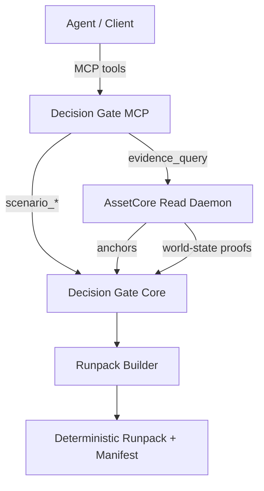
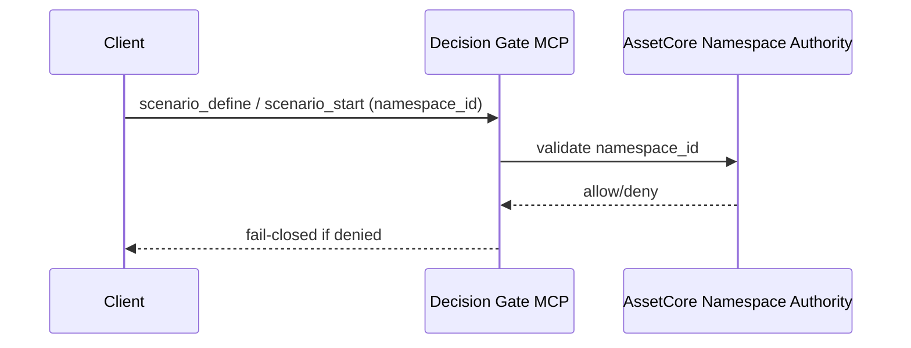
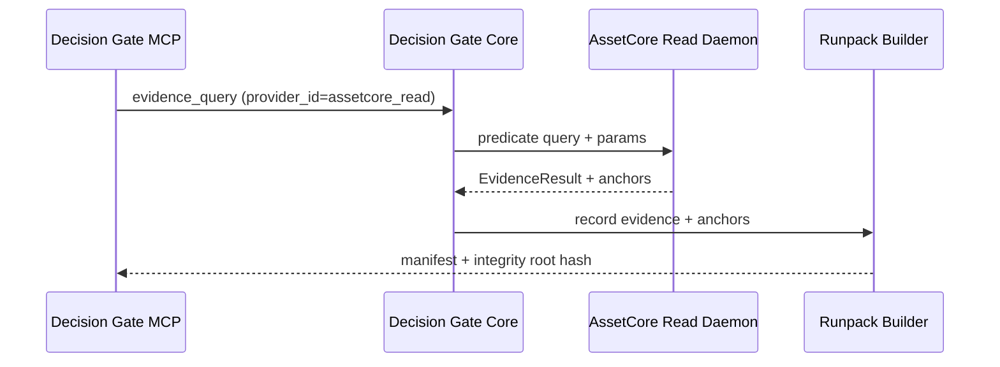

<!--
Docs/integrations/assetcore/architecture.md
============================================================================
Document: DG + AssetCore Integration Architecture
Description: Architecture and data flow for DG/ASC alignment.
Purpose: Provide crisp, implementation-ready diagrams and flow.
Dependencies:
  - Docs/architecture/decision_gate_assetcore_integration_contract.md
============================================================================
-->

# DG + AssetCore Architecture

## High-Level Topology

## Namespace Authority Flow

## Evidence Anchoring Flow

## Auth Mapping (Integration Layer)
DG does not parse ASC auth tokens. An external integration layer verifies ASC
principals and forwards a minimal principal context (tenant_id, principal_id,
roles, policy_class, groups). Mapping defaults are conservative and fail-closed.

## Schema Registry ACL (DG Internal)
Schema registry access is enforced inside DG after tool allowlists. Integration
layer RBAC determines which tools are callable; DG's registry ACL determines
per-tenant/namespace read/write permission for `schemas_*`.

Reference: `Docs/architecture/decision_gate_assetcore_integration_contract.md`
