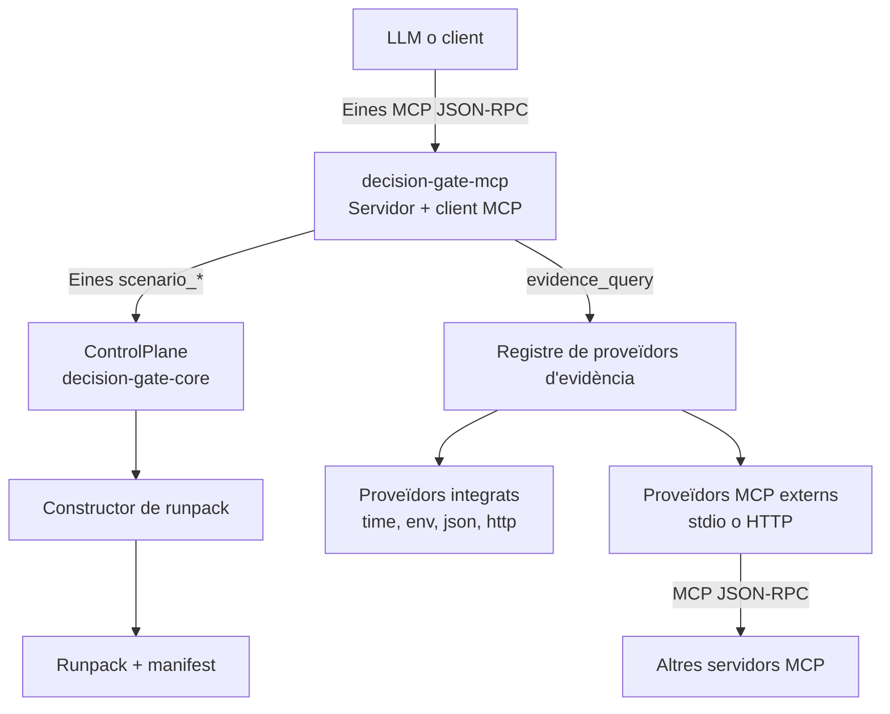
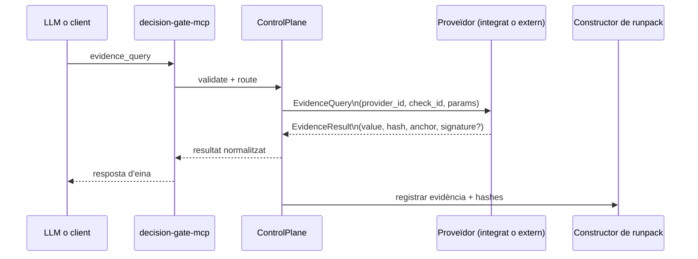
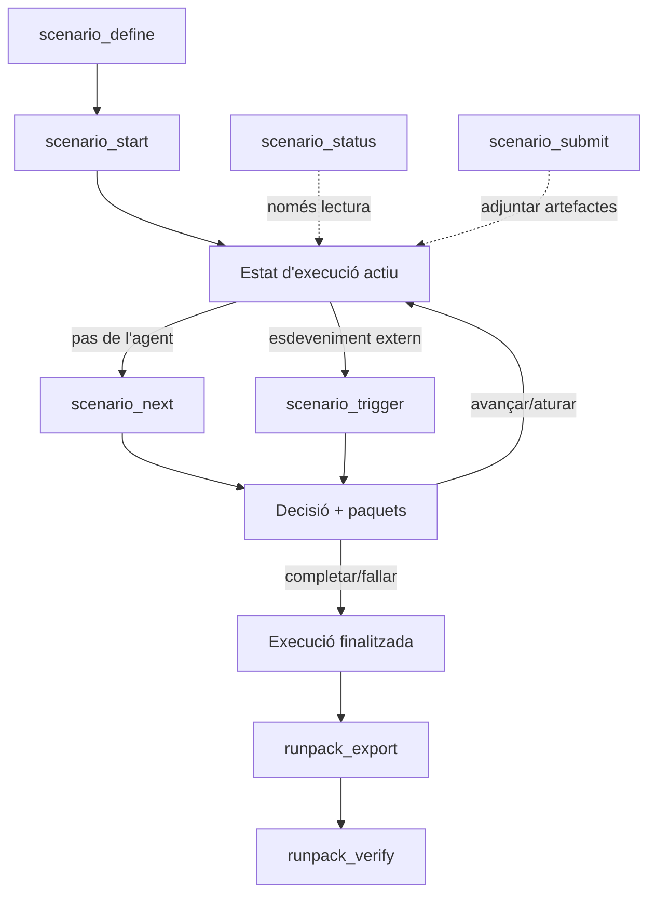

<!--
README.ca.md
============================================================================
Document: Decision Gate README (Català)
Description: Visió general del repositori i inici ràpid per a Decision Gate.
Purpose: Introduir el projecte i enllaçar la documentació principal.
Dependencies:
  - Docs/guides/getting_started.md
  - Docs/security/threat_model.md
============================================================================
-->

# Decision Gate

Idiomes: [Anglès](README.md) | Català

**Nota**: aquesta versió és una traducció automàtica. Pot contenir errors o matisos imprecisos.

Nota: s'està treballant per traduir la documentació a altres llengües. Consulteu
[assetcore.io/decision-gate](https://assetcore.io/decision-gate) per veure les llengües disponibles actualment.

Decision Gate és un sistema determinista de punts de control i d'avaluació de requisits
per a passos amb porta i divulgació controlada. Avalua portes basades en evidència,
decideix si es compleixen les condicions i emet decisions auditables. En un sentit operatiu,
està orientat a l'avaluació de tasques/LLM.

La motivació original va venir d'un experiment amb AssetCore: necessitava divulgar
informació de manera progressiva a LLMs a mesura que canviaven les condicions externes.
Després de bregar amb el problema durant uns quants dies, vaig adonar-me que el
[crate ret-logic](ret-logic/README.md) que ja havia construït podia modelar el problema
general. Aquest repositori n'és el resultat. Si vols els detalls d'integració,
comença per [Docs/integrations/assetcore/README.md](Docs/integrations/assetcore/README.md).

Espero que sigui útil per millorar la fiabilitat, la seguretat i el rendiment del
programari (no només LLMs) en molts sectors. Donada la naturalesa matemàtica del
problema, el model nucli és estable; el treball a curt termini se centra en l'ergonomia
i en un ecosistema de proveïdors més ampli. Per a més informació, consulta
[Docs/roadmap/README.md](Docs/roadmap/README.md).

## Taula de continguts

- [Visió general](#visió-general)
- [Inici ràpid](#inici-ràpid)
- [Documentació](#documentació)
- [Integració amb AssetCore](#integració-amb-assetcore)
- [Estat actual (notes de precisió)](#estat-actual-notes-de-precisió)
- [Arquitectura d'un cop d'ull](#arquitectura-dun-cop-dull)
- [Model de proveïment d'evidència](#model-de-proveïment-devidència)
- [Per què els integrats + JSON arriben lluny](#per-què-els-integrats--json-arriben-lluny)
- [Estructura del repositori](#estructura-del-repositori)
- [Conceptes clau](#conceptes-clau)
- [Com es defineixen les condicions](#com-es-defineixen-les-condicions)
- [Guia d'autoria d'escenaris](#guia-dautoria-descenaris)
- [Proveïdors integrats (consulteu la referència)](#proveïdors-integrats-consulteu-la-referència)
- [Exemple de proveïdor: base de dades](#exemple-de-proveïdor-base-de-dades)
- [Superfície d'eines MCP](#superfície-deines-mcp)
- [Artefactes de contracte](#artefactes-de-contracte)
- [Runpacks i verificació](#runpacks-i-verificació)
- [Exemples](#exemples)
- [Glossari](#glossari)
- [Com donar suport a aquest projecte](#com-donar-suport-a-aquest-projecte)
- [Seguretat](#seguretat)
- [Format](#format)
- [Contribuir](#contribuir)
- [Autors](#autors)
- [Referències](#referències)

## Visió general

Decision Gate és un pla de control per a punts de control deterministes. No executa
converses ni agents. Ingereix triggers, avalua condicions basades en evidència
i emet decisions i divulgacions auditables. L'evidència pot ser obtinguda per un
proveïdor (verificada) o aportada per a precheck; les dades aportades mai no muten
l'estat d'execució. Decision Gate no executa tasques arbitràries; l'evidència és
produïda per proveïdors o pel cridador en precheck, i el nucli només la avalua.
En un sentit operatiu, això és l'avaluació de tasques/LLM: el progrés queda bloquejat
fins que es compleixin requisits explícits.

## Inici ràpid

- Regenerar artefactes: `scripts/ci/generate_all.sh`
- Verificar-ho tot (sense system tests): `scripts/ci/verify_all.sh`
- Verificar-ho tot + system tests: `scripts/ci/verify_all.sh --system-tests=p0`
- Executar proves del nucli: `cargo test -p decision-gate-core`
- Executar proves del broker: `cargo test -p decision-gate-broker`
- Smoke test d'inici ràpid en un sol comandament:
  - Bash/WSL: `scripts/bootstrap/quickstart.sh`
  - PowerShell: `scripts/bootstrap/quickstart.ps1`
- Índex de scripts: `scripts/README.md`
- Executar exemples:
  - `cargo run -p decision-gate-example-minimal`
  - `cargo run -p decision-gate-example-file-disclosure`
  - `cargo run -p decision-gate-example-llm-scenario`
  - `cargo run -p decision-gate-example-agent-loop`
  - `cargo run -p decision-gate-example-ci-gate`
  - `cargo run -p decision-gate-example-data-disclosure`
- Executar el CLI:
  - `cargo run -p decision-gate-cli -- serve --config configs/presets/quickstart-dev.toml`
- Configs predefinides: `configs/presets/` (vegeu `Docs/guides/preset_configs.md`)
- Desplegament en contenidors: `Docs/guides/container_deployment.md`
- Estat d'execució persistent: configureu `run_state_store` a `decision-gate.toml` per usar
  el backend SQLite (vegeu `Docs/configuration/decision-gate.toml.md`).

## Documentació

- Introducció: `Docs/guides/getting_started.md`
- Configs predefinides: `Docs/guides/preset_configs.md`
- Desplegament en contenidors: `Docs/guides/container_deployment.md`
- Configuració: `Docs/configuration/decision-gate.toml.md`
- Desenvolupament de proveïdors: `Docs/guides/provider_development.md`
- Guia de seguretat: `Docs/guides/security_guide.md`
- Patrons d'integració: `Docs/guides/integration_patterns.md`
- Manual d'evidència JSON: `Docs/guides/json_evidence_playbook.md`
- Manual LLM-native: `Docs/guides/llm_native_playbook.md`
- Dogfood de la porta de release en CI: `Docs/guides/ci_release_gate_dogfood.md`
- Hub d'integració AssetCore: [Docs/integrations/assetcore/](Docs/integrations/assetcore/)
- Mirall de docs allotjades + explicacions ampliades: [assetcore.io/docs/decision-gate](https://assetcore.io/docs/decision-gate)
- Arquitectura:
  - `Docs/architecture/comparator_validation_architecture.md`
  - `Docs/architecture/decision_gate_assetcore_integration_contract.md`
  - `Docs/architecture/decision_gate_namespace_registry_rbac_architecture.md`
  - `Docs/architecture/decision_gate_auth_disclosure_architecture.md`
  - `Docs/architecture/decision_gate_evidence_trust_anchor_architecture.md`
  - `Docs/architecture/decision_gate_runpack_architecture.md`
  - `Docs/architecture/decision_gate_scenario_state_architecture.md`
  - `Docs/architecture/decision_gate_provider_capability_architecture.md`
  - `Docs/architecture/decision_gate_system_test_architecture.md`

Nota de dogfooding en CI: el flux de tags de release avalua una política de
Decision Gate sobre evidència de CI i exporta un runpack per a auditoria. Vegeu
`Docs/guides/ci_release_gate_dogfood.md`.

## Integració amb AssetCore

**Tagline**: DG avalua requisits. ASC proporciona el substrat d'estat del món
per a evidència determinista.

**Compatibilitat**: Compatible amb AssetCore.

**Visió general d'AssetCore**: [assetcore.io/asset-core](https://assetcore.io/asset-core).

Decision Gate s'executa de manera independent. Quan un flux de treball requereix
proves deterministes, replay i proves d'estat del món de grau d'auditoria, DG
s'integra amb AssetCore mitjançant interfícies explícites (sense acoblament de
codi). El hub d'integració canònic és a `Docs/integrations/assetcore/`.

## Estat actual (notes de precisió)

Decision Gate està en desenvolupament actiu; les APIs i la configuració poden canviar.

Implementat en OSS:

- Vies de confiança (verificada vs aportada) amb enforcement de portes/condicions.
- Registre d'esquemes amb ACLs, esdeveniments d'auditoria i eines de descoberta.
- Comprovacions d'autoritat d'espai de noms (inclosa l'autoritat HTTP d'AssetCore opcional).
- Mode permissiu de desenvolupament per a evidència aportada (acotat, amb avisos).
- Eina de precheck amb validació d'esquemes (via MCP).

Límits operatius:

- Els proveïdors externs estan en desenvolupament actiu i encara no són estables/endurits.
- No hi ha reintents integrats per a proveïdors MCP externs.
- Els valors d'evidència bruts es redaccionen per defecte si no s'activen explícitament.
- L'ergonomia i els punts de fricció s'estan polint activament; espereu arestes.

## Arquitectura d'un cop d'ull

Decision Gate és alhora un servidor MCP (superfície d'eines) i un client MCP
(federació d'evidència). El pla de control és sempre el mateix camí de codi.

```text
LLM o client
  |
  | Eines MCP JSON-RPC
  v
decision-gate-mcp (tools/list, tools/call)
  |
  | scenario_* -> ControlPlane (decision-gate-core)
  | evidence_query -> Registre de proveïdors d'evidència
  | schemas_* / precheck -> Registre d'esquemes + validació
  v
Fonts d'evidència
  - proveïdors integrats (time, env, json, http)
  - proveïdors MCP externs (stdio o HTTP)
  - evidència aportada (només precheck; no és una execució activa)

Runpack builder -> artefactes deterministes + manifest
```

### Diagrames d'arquitectura (Mermaid)

Topologia d'alt nivell i rols:



Flux de consulta d'evidència (cablejat de proveïdors):



Cicle de vida d'escenaris (eines + runpacks):



Terminologia de proveïdors:

- **Proveïdor**: una font d'evidència (integrada o servidor MCP extern) que respon consultes d'evidència.
- **Entrada de proveïdor**: una entrada de configuració `[[providers]]` a `decision-gate.toml` que registra un proveïdor.
- **Regles de noms de proveïdors**: els noms de proveïdors són únics i els identificadors integrats (`time`, `env`, `json`, `http`) són reservats (els proveïdors MCP no els poden usar).

## Model de proveïment d'evidència

Decision Gate admet tres modes de proveïment d'evidència. La lògica d'avaluació és la
mateixa; només canvien la font i la via de confiança.

1. **Evidència obtinguda pel proveïdor (execucions actives)**  
   DG crida un proveïdor (integrat o MCP extern) per obtenir evidència. Això és el
   valor per defecte per a execucions actives i admet requisits estrictes de confiança i signatures.

2. **Evidència aportada (només precheck)**  
   El cridador proporciona payloads d'evidència per a una petició de precheck. Els
   payloads es validen contra un esquema de dades registrat, però el precheck no muta
   l'estat d'execució. És útil per a agents de confiança o comprovacions ràpides de "què passaria si".

3. **Enviaments d'auditoria (scenario_submit)**  
   Els enviaments s'emmagatzemen amb hashes per a auditoria, però no afecten l'avaluació de portes.

Decision Gate no executa tasques arbitràries. Si necessites executar una eina
(formatadors, proves, escàners), fes-ho fora de DG i aporta el resultat com a evidència.

## Per què els integrats + JSON arriben lluny

La majoria de preguntes de tipus "s'ha fet X?" es poden expressar com a dades:

- Si una eina pot emetre JSON, el proveïdor **json** pot posar-li una porta.
- Si les dades són darrere d'una API, el proveïdor **http** pot obtenir un senyal acotat.
- Si el senyal ja és en configuració o a l'entorn, **env** i **time** cobreixen portes operatives comunes.

Això evita execució arbitrària dins de DG mentre cobreix la majoria de portes de flux de treball:

- lint/format -> l'eina escriu un informe JSON -> el proveïdor `json` valida camps
- proves/cobertura -> el runner de proves emet JSON -> el comparador comprova `failed == 0`
- escàners de seguretat -> sortida JSON -> el comparador comprova els comptadors de severitat
- metadades de release -> fitxer JSON o endpoint HTTP -> el comparador comprova la versió

Si necessites fonts més riques (bases de dades, APIs SaaS), implementa un proveïdor MCP extern;
el model d'avaluació del nucli es manté igual.

## Estructura del repositori

- `decision-gate-core`: motor determinista, esquemes i eines de runpack
- `decision-gate-broker`: fonts/embornals de referència i dispatcher compost
- `decision-gate-contract`: definicions canòniques del contracte + generador
- `decision-gate-providers`: proveïdors d'evidència integrats (time, env, json, http)
- `decision-gate-mcp`: servidor MCP i federació d'evidència
- `decision-gate-cli`: CLI per al servidor MCP i utilitats de runpack
- `decision-gate-provider-sdk`: plantilles de proveïdor (TypeScript, Python, Go)
- `ret-logic`: motor universal d'avaluació de requisits (RET)
- `examples/`: exemples executables (`minimal`, `file-disclosure`, `llm-scenario`, `agent-loop`, `ci-gate`, `data-disclosure`)

## Conceptes clau

**ScenarioSpec**: La definició completa de l'escenari. Conté etapes, portes i
condicions. Un escenari és la unitat d'execució.

**StageSpec**: Una etapa d'escenari. Cada etapa té zero o més portes i una
política d'avanç (`linear`, `fixed`, `branch` o `terminal`).

**GateSpec**: Una porta amb un arbre de requisits. És aquí on s'aplica `ret-logic`.

**ConditionSpec**: Una condició amb nom que vincula una fulla del requisit a una
consulta d'evidència i un comparador.

**EvidenceQuery**: La forma canònica d'una consulta a un proveïdor:
`provider_id`, `check_id` i `params`.

**EvidenceResult**: La resposta del proveïdor que conté un valor, hash, ancoratge
i metadades de signatura opcionals.

**TrustLane**: Classificació de confiança de l'evidència (`verified` o `asserted`),
aplicada a nivell de porta/condició. Si la confiança no és suficient, el resultat és
Unknown i l'execució queda en espera.

**Namespace**: Partició lògica dins d'un tenant per aïllar escenaris,
esquemes i estat d'execució.

**Data Shape**: Esquema JSON versionat utilitzat per validar payloads aportats en precheck.

**Runpack**: Paquet determinista d'artefactes d'execució i un manifest per a
verificació offline.

## Com es defineixen les condicions

Aquesta és la distinció crítica:

- `ret-logic` defineix **com es componen les condicions** (AND, OR, NOT,
  require-group). No defineix paràmetres de comprovació.
- Els proveïdors defineixen **què significa una comprovació** i quins paràmetres
  són acceptats. Això s'implementa dins de cada proveïdor.

En termes pràctics, el format de la comprovació es defineix per:

1. La forma d'`EvidenceQuery` a `decision-gate-core` (provider_id, check_id, params).
2. La implementació del proveïdor que interpreta `check_id` i `params`.

El crate de contracte canònic (`decision-gate-contract`) defineix les capacitats dels
proveïdors com a estructures de dades Rust perquè els esquemes de comprovació, docs i tooltips
es generin (no es mantinguin a mà). Els artefactes generats viuen sota
`Docs/generated/decision-gate`. Després de qualsevol canvi de comportament o esquema,
actualitza els tooltips del contracte i regenera els artefactes generats per mantenir-los alineats.

## Guia d'autoria d'escenaris

Això és un flux d'autoria complet d'extrem a extrem utilitzant el model del nucli.

### 1) Identificar fonts d'evidència

Decideix d'on ve la prova. Cada font és un proveïdor (integrat o extern),
o un artefacte JSON que una eina escriu perquè el proveïdor `json` el llegeixi.
Exemples:

- proveïdor `time` per a planificació
- proveïdor `env` per a portes d'entorn
- proveïdor `json` per a consultes de fitxers
- proveïdor `http` per a comprovacions d'endpoint
- proveïdor `database` per a comprovacions de base de dades externa (proveïdor MCP extern)

### 2) Definir condicions

Les condicions vinculen una consulta a un proveïdor (comprovació) amb un comparador.
Aquesta és la superfície de prova.

```json
{
  "condition_id": "deploy_env",
  "query": {
    "provider_id": "env",
    "check_id": "get",
    "params": { "key": "DEPLOY_ENV" }
  },
  "comparator": "equals",
  "expected": "production",
  "policy_tags": []
}
```

### 3) Compondre portes amb ret-logic

Les portes són arbres de requisits construïts amb identificadors de condicions.

```json
{
  "gate_id": "ready",
  "requirement": {
    "And": [{ "Condition": "deploy_env" }, { "Condition": "build_passed" }]
  }
}
```

### 4) Construir etapes

Les etapes contenen portes i defineixen cap on va l'execució després.

```json
{
  "stage_id": "main",
  "gates": [
    { "gate_id": "ready", "requirement": { "Condition": "deploy_env" } }
  ],
  "advance_to": { "kind": "terminal" },
  "entry_packets": [],
  "timeout": null,
  "on_timeout": "fail"
}
```

### 5) Executar l'escenari

Utilitza les eines MCP o el CLI per definir, iniciar i avançar l'execució:

- `scenario_define`
- `scenario_start`
- `scenario_next`
- `scenario_status`
- `scenario_submit`
- `scenario_trigger`

Els runpacks es poden exportar i verificar offline després de l'execució.

## Proveïdors integrats (consulteu la referència)

Aquests són els proveïdors per defecte inclosos a `decision-gate-providers/src`.

### time

- `now`: retorna el timestamp del trigger com a JSON.
- `after`: compara l'hora del trigger amb un llindar.
- `before`: compara l'hora del trigger amb un llindar.

Paràmetres:

```json
{ "timestamp": 1710000000000 }
```

o:

```json
{ "timestamp": "2024-01-01T00:00:00Z" }
```

### env

- `get`: obté una variable d'entorn.

Paràmetres:

```json
{ "key": "DEPLOY_ENV" }
```

### json

- `path`: llegeix un fitxer JSON o YAML i opcionalment selecciona un JSONPath.
  Aquest és el principal pont per a sortides d'eines (formatadors, proves, escàners)
  que poden emetre artefactes JSON.

Paràmetres:

```json
{ "file": "/config.json", "jsonpath": "$.version" }
```

### http

- `status`: retorna el codi d'estat HTTP d'un URL.
- `body_hash`: retorna un hash del cos de la resposta.

Paràmetres:

```json
{ "url": "https://api.example.com/health" }
```

## Exemple de proveïdor: base de dades

Les bases de dades no són integrades. S'implementen com a proveïdors MCP externs.

### Exemple de condició

```json
{
  "condition_id": "user_status",
  "query": {
    "provider_id": "database",
    "check_id": "field_value",
    "params": {
      "source": "app_db",
      "table": "users",
      "filter": { "id": "user-123" },
      "field": "status"
    }
  },
  "comparator": "equals",
  "expected": "active",
  "policy_tags": []
}
```

### Què vol dir això

- El format de la comprovació (`field_value` i els seus paràmetres) està definit
  pel proveïdor de base de dades, no per `ret-logic`.
- Decision Gate ho tracta com una consulta al proveïdor `database` i avalua
  l'evidència retornada amb el comparador.

## Superfície d'eines MCP

Decision Gate exposa eines MCP que mapen directament al pla de control:

- `scenario_define`
- `scenario_start`
- `scenario_status`
- `scenario_next`
- `scenario_submit`
- `scenario_trigger`
- `evidence_query`
- `providers_list`
- `provider_contract_get`
- `provider_check_schema_get`
- `schemas_register`
- `schemas_list`
- `schemas_get`
- `scenarios_list`
- `precheck`
- `runpack_export`
- `runpack_verify`

Aquestes són capes fines sobre el mateix motor del nucli i estan pensades per
a ser generades a docs i SDKs.

## Artefactes de contracte

El generador de contractes emet artefactes deterministes per a docs i SDKs:

- `Docs/generated/decision-gate/tooling.json`: esquemes d'eines MCP
- `Docs/generated/decision-gate/providers.json`: esquemes de comprovació de proveïdors
- `Docs/generated/decision-gate/schemas/`: esquemes JSON d'escenaris + configuració
- `Docs/generated/decision-gate/examples/`: exemples canònics

Generar o verificar artefactes:

```sh
cargo run -p decision-gate-contract -- generate
cargo run -p decision-gate-contract -- check
```

Proves de validació d'esquemes (contracte + conformitat d'execució):

```sh
cargo test -p decision-gate-contract --test schema_validation
cargo test -p decision-gate-mcp --test contract_schema_e2e
```

## Runpacks i verificació

Els runpacks són paquets deterministes que contenen l'especificació d'escenari, el
registre de triggers, avaluacions de portes, decisions, enviaments i crides d'eina.
Un manifest amb hashes permet verificació offline de la integritat i detecció
de manipulació.

## Exemples

- `examples/minimal`: cicle de vida d'escenari bàsic
- `examples/file-disclosure`: flux de divulgació de paquets
- `examples/llm-scenario`: escenari d'estil LLM
- `examples/agent-loop`: satisfacció de portes multi-passos
- `examples/ci-gate`: porta d'aprovació de CI
- `examples/data-disclosure`: etapa de divulgació amb paquets

## Glossari

**Proveïdor**: Una font d'evidència (integrada o servidor MCP extern) que subministra comprovacions.

**Entrada de proveïdor**: L'entrada de configuració `[[providers]]` que registra un proveïdor.

**Adaptador**: Un terme genèric per a proveïdor; a Decision Gate s'usa "proveïdor".

**Comprovació**: Una capacitat de proveïdor identificada per `check_id` en una `EvidenceQuery`.

**Condició**: Una fulla d'escenari amb nom que vincula una comprovació de proveïdor amb un comparador i un valor esperat.

**Requisit**: Una composició lògica de condicions (AND, OR, NOT, group).

**Escenari**: La definició completa d'etapes, portes i condicions.

**Porta**: Un arbre de requisits que s'ha de superar per avançar d'etapa.

**Evidència**: Sortida del proveïdor enregistrada amb hashes i ancoratges.

**Runpack**: Artefacte determinista utilitzat per a verificació offline.

## Com donar suport a aquest projecte

- Necessitats enterprise: vegeu [Docs/enterprise/decision_gate_enterprise.md](Docs/enterprise/decision_gate_enterprise.md) i [assetcore.io/decision-gate](https://assetcore.io/decision-gate).
- Persones individuals: llibres de ficció a [yungbidness.dev/#books](https://yungbidness.dev/#books).
- Socis d'avaluació primerenca d'AssetCore: busquem treballar de prop amb un petit nombre d'equips seriosos per endurir els límits de desplegament i la usabilitat abans d'un llançament més ampli. Vegeu [assetcore.io](https://assetcore.io/).

## Seguretat

Decision Gate assumeix entrades hostils i falla tancat amb evidència absent o invàlida.
Vegeu `Docs/security/threat_model.md` i `Docs/guides/security_guide.md` per al
model d'amenaça i els controls operatius.

## Format

El format requereix rustfmt nightly. Useu:

```sh
cargo +nightly fmt --all
```

No useu `cargo fmt` en aquest repositori.

## Contribuir

Aquest projecte no accepta pull requests actualment.

Si us plau, obriu un issue si voleu reportar un error, proposar una funcionalitat o iniciar una
discussió. Vegeu `CONTRIBUTING.md` per a més detalls.

## Autors

Decision Gate està construït per Michael "Yung Bidness" Campbell.

- AssetCore: [assetcore.io](https://assetcore.io)
- Lloc personal: [yungbidness.dev](https://yungbidness.dev)
- LinkedIn: [Michael Campbell](https://www.linkedin.com/in/michael-campbell-73159b5a/)

## Referències

- Kingdom of Giants, Jt Cavey. (2017). _Tunnel Vision_ [Enregistrament d'àudio]. YouTube. [https://www.youtube.com/watch?v=eR_P5c69NtY](https://www.youtube.com/watch?v=eR_P5c69NtY)
- The Amity Affliction. (2014). _Pittsburgh_ [Enregistrament d'àudio]. YouTube. [https://www.youtube.com/watch?v=vu3xGr-lNVI](https://www.youtube.com/watch?v=vu3xGr-lNVI)
- Secrets. (2019). _My Mind, Myself & I_ [Enregistrament d'àudio]. YouTube. [https://www.youtube.com/watch?v=51xzsGkQIcQ](https://www.youtube.com/watch?v=51xzsGkQIcQ)
- Kublai Khan TX. (2017). _The Hammer_ [Enregistrament d'àudio]. YouTube. [https://www.youtube.com/watch?v=8GGMdMo61_o](https://www.youtube.com/watch?v=8GGMdMo61_o)
- Paleface Swiss. (2023). _The Gallow_ [Enregistrament d'àudio]. YouTube. [https://www.youtube.com/watch?v=ThvEJXMeYOA](https://www.youtube.com/watch?v=ThvEJXMeYOA)
- Upon A Burning Body. (2016). _You Don't Own Me_ [Enregistrament d'àudio]. YouTube. [https://www.youtube.com/watch?v=5GEzTkYWCFQ](https://www.youtube.com/watch?v=5GEzTkYWCFQ)
