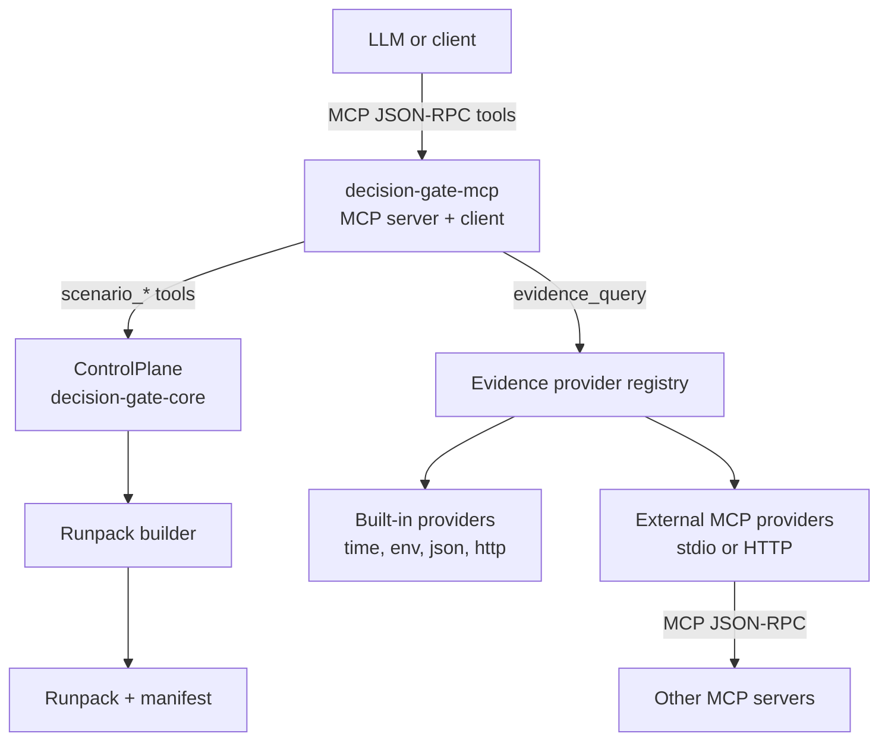
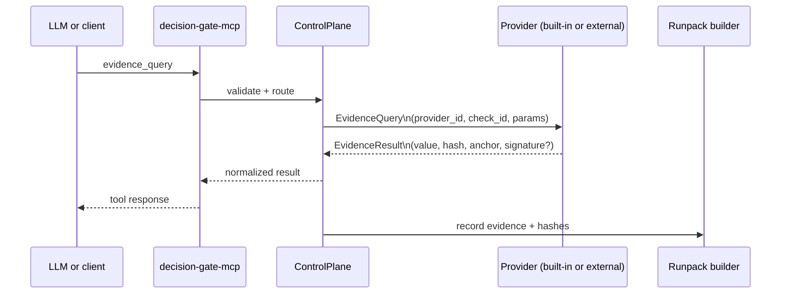
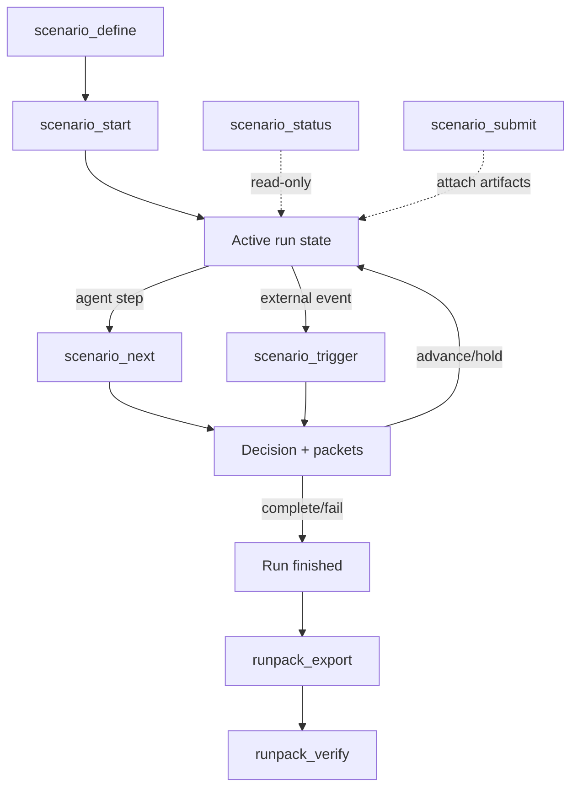

<!--
README.md
============================================================================
Document: Decision Gate README
Description: Repository overview and quick start for Decision Gate.
Purpose: Introduce the project and link to core documentation.
Dependencies:
  - Docs/guides/getting_started.md
  - Docs/security/threat_model.md
============================================================================
-->

# Decision Gate

[](LICENSE)
[](rust-toolchain.toml)

Languages: [English](README.md) | [Català](README.ca.md)

Note: Work is ongoing to translate documentation into additional languages. Please see
[assetcore.io/decision-gate](https://assetcore.io/decision-gate) for currently supported languages.

Agents can call programs as tools, but they are stochastic actors. They cannot
prove they followed requirements, cannot guarantee the same outcome twice, and
cannot show a verifiable execution trail.

If an agent cannot prove why it did something, you cannot ship it in regulated
or high-risk workflows.

Decision Gate closes that gap with deterministic, program-grade formalism:
explicit checkpoints that evaluate evidence and produce auditable decisions.
Any process that produces data and has a desired end state can be gated.

## Table of Contents

- [Overview](#overview)
- [Quick Start](#quick-start)
- [Docs](#docs)
- [AssetCore Integration](#assetcore-integration)
- [Current Status (Accuracy Notes)](#current-status-accuracy-notes)
- [Architecture at a Glance](#architecture-at-a-glance)
- [Evidence Sourcing Model](#evidence-sourcing-model)
- [Why Built-ins + JSON Go Far](#why-built-ins--json-go-far)
- [Repository Layout](#repository-layout)
- [Core Concepts](#core-concepts)
- [How Conditions Are Defined](#how-conditions-are-defined)
- [Scenario Authoring Walkthrough](#scenario-authoring-walkthrough)
- [Built-in Providers (Check Reference)](#built-in-providers-check-reference)
- [Provider Example: Database](#provider-example-database)
- [MCP Tool Surface](#mcp-tool-surface)
- [Contract Artifacts](#contract-artifacts)
- [Runpacks and Verification](#runpacks-and-verification)
- [Examples](#examples)
- [Glossary](#glossary)
- [How to Support This Project](#how-to-support-this-project)
- [Security](#security)
- [Formatting](#formatting)
- [Contributing](#contributing)
- [Author's Note](#authors-note)
- [References](#references)

## Overview

Decision Gate is a control plane for deterministic checkpoints. It does not run
conversations or agents. It ingests triggers, evaluates evidence-backed
conditions, and emits auditable decisions and disclosures. Evidence can be
provider-pulled (verified) or asserted for precheck; asserted data never mutates
run state. Decision Gate does not execute arbitrary tasks; evidence is produced
by providers or by a caller in precheck, and the core only evaluates it.
In the operational sense, this is LLM/task evaluation: progress is gated until
explicit requirements are satisfied.

## Quick Start

- Regenerate artifacts: `scripts/ci/generate_all.sh`
- Verify all (non-system tests): `scripts/ci/verify_all.sh`
- Verify all + system tests: `scripts/ci/verify_all.sh --system-tests=p0`
- Run core tests: `cargo test -p decision-gate-core`
- Run broker tests: `cargo test -p decision-gate-broker`
- One-command quickstart smoke test:
  - Bash/WSL: `scripts/bootstrap/quickstart.sh`
  - PowerShell: `scripts/bootstrap/quickstart.ps1`
- Scripts index: `scripts/README.md`
- Run examples:
  - `cargo run -p decision-gate-example-minimal`
  - `cargo run -p decision-gate-example-file-disclosure`
  - `cargo run -p decision-gate-example-llm-scenario`
  - `cargo run -p decision-gate-example-agent-loop`
  - `cargo run -p decision-gate-example-ci-gate`
  - `cargo run -p decision-gate-example-data-disclosure`
- Run the CLI:
  - `cargo run -p decision-gate-cli -- serve --config configs/presets/quickstart-dev.toml`
- Preset configs: `configs/presets/` (see `Docs/guides/preset_configs.md`)
- Container deployment: `Docs/guides/container_deployment.md`
- Durable run state: configure `run_state_store` in `decision-gate.toml` to use
  the SQLite backend (see `Docs/configuration/decision-gate.toml.md`).

## Docs

- Getting started: `Docs/guides/getting_started.md`
- Preset configs: `Docs/guides/preset_configs.md`
- Container deployment: `Docs/guides/container_deployment.md`
- Configuration: `Docs/configuration/decision-gate.toml.md`
- Provider development: `Docs/guides/provider_development.md`
- Security guide: `Docs/guides/security_guide.md`
- Integration patterns: `Docs/guides/integration_patterns.md`
- JSON evidence playbook: `Docs/guides/json_evidence_playbook.md`
- LLM-native playbook: `Docs/guides/llm_native_playbook.md`
- CI release gate dogfood: `Docs/guides/ci_release_gate_dogfood.md`
- AssetCore integration hub: [Docs/integrations/assetcore/](Docs/integrations/assetcore/)
- Hosted docs mirror + expanded explanations: [assetcore.io/docs/decision-gate](https://assetcore.io/docs/decision-gate)
- Architecture:
  - `Docs/architecture/comparator_validation_architecture.md`
  - `Docs/architecture/decision_gate_assetcore_integration_contract.md`
  - `Docs/architecture/decision_gate_namespace_registry_rbac_architecture.md`
  - `Docs/architecture/decision_gate_auth_disclosure_architecture.md`
  - `Docs/architecture/decision_gate_evidence_trust_anchor_architecture.md`
  - `Docs/architecture/decision_gate_runpack_architecture.md`
  - `Docs/architecture/decision_gate_scenario_state_architecture.md`
  - `Docs/architecture/decision_gate_provider_capability_architecture.md`
  - `Docs/architecture/decision_gate_system_test_architecture.md`

CI dogfooding note: the release tag workflow evaluates a Decision Gate policy
over CI evidence and exports a runpack for audit. See
`Docs/guides/ci_release_gate_dogfood.md`.

## AssetCore Integration

**Tagline**: DG evaluates requirements. ASC provides the world-state substrate
for deterministic evidence.

**Compatibility**: Compatible with AssetCore.

**AssetCore overview**: [assetcore.io/asset-core](https://assetcore.io/asset-core).

Decision Gate runs independently. When a workflow requires deterministic
evidence, replay, and audit-grade world-state proofs, DG integrates with
AssetCore through explicit interfaces (no code coupling). The canonical
integration hub lives at `Docs/integrations/assetcore/`.

## Current Status (Accuracy Notes)

Decision Gate is in active development; APIs and config may change.

Implemented in OSS:

- Trust lanes (verified vs asserted) with gate/condition enforcement.
- Schema registry with ACLs, audit events, and discovery tools.
- Namespace authority checks (including optional AssetCore HTTP authority).
- Dev-permissive mode for asserted evidence (scoped, warning-emitting).
- Precheck tool with schema validation (via MCP).

Operational limits:

- External providers are under active development and are not yet stable/hardened.
- External MCP provider retries are not built in.
- Raw evidence values are redacted by default unless explicitly enabled.
- Ergonomics and developer pain points are actively being refined; expect rough edges.

## Architecture at a Glance

Decision Gate is both an MCP server (tool surface) and an MCP client (evidence
federation). The control plane is always the same codepath.

```text
LLM or client
  |
  | MCP JSON-RPC tools
  v
decision-gate-mcp (tools/list, tools/call)
  |
  | scenario_* -> ControlPlane (decision-gate-core)
  | evidence_query -> EvidenceProvider registry
  | schemas_* / precheck -> Schema registry + validation
  v
Evidence sources
  - built-in providers (time, env, json, http)
  - external MCP providers (stdio or HTTP)
  - asserted evidence (precheck only; not a live run)

Runpack builder -> deterministic artifacts + manifest
```

### Architecture Diagrams (Mermaid)

High-level topology and roles:



Evidence query flow (provider wiring):



Scenario lifecycle (tools + runpacks):



Provider terminology:

- **Provider**: an evidence source (built-in or external MCP server) that answers evidence queries.
- **Provider entry**: a `[[providers]]` config entry in `decision-gate.toml` that registers a provider.
- **Provider name rules**: provider names are unique and built-in identifiers (`time`, `env`, `json`, `http`) are reserved (MCP providers cannot use them).

## Evidence Sourcing Model

Decision Gate supports three evidence sourcing modes. The evaluation logic is
the same; only the source and trust lane differ.

1. **Provider-pulled evidence (live runs)**  
   DG calls a provider (built-in or external MCP) to fetch evidence. This is the
   default for live runs and supports strict trust requirements and signatures.

2. **Asserted evidence (precheck only)**  
   The caller supplies evidence payloads for a precheck request. Payloads are
   schema-validated against a registered data shape, but precheck does not mutate
   run state. This is useful for trusted agents or fast "what if" checks.

3. **Audit submissions (scenario_submit)**  
   Submissions are stored with hashes for audit, but do not affect gate evaluation.

Decision Gate does not execute arbitrary tasks. If you need to run a tool
(formatter, tests, scans), run it outside DG and provide the result as evidence.

## Why Built-ins + JSON Go Far

Most "has X been done?" questions can be expressed as data:

- If a tool can emit JSON, the **json** provider can gate it.
- If data lives behind an API, the **http** provider can fetch a bounded signal.
- If the signal is already in config or the environment, **env** and **time**
  cover common operational gates.

This pattern avoids arbitrary execution inside DG while still covering most
workflow gates:

- lint/format checks -> tool writes JSON report -> `json` provider validates fields
- tests/coverage -> test runner emits JSON -> comparator checks `failed == 0`
- security scans -> JSON output -> comparator checks severity counts
- release metadata -> JSON file or HTTP endpoint -> comparator checks version

If you need richer sources (databases, SaaS APIs), implement an external MCP
provider; the core evaluation model stays the same.

## Repository Layout

- `decision-gate-core`: deterministic engine, schemas, and runpack tooling
- `decision-gate-broker`: reference sources/sinks and composite dispatcher
- `decision-gate-contract`: canonical contract definitions + generator
- `decision-gate-providers`: built-in evidence providers (time, env, json, http)
- `decision-gate-mcp`: MCP server and evidence federation
- `decision-gate-cli`: CLI for MCP server and runpack utilities
- `decision-gate-provider-sdk`: provider templates (TypeScript, Python, Go)
- `ret-logic`: universal requirement evaluation engine (RET)
- `examples/`: runnable examples (`minimal`, `file-disclosure`, `llm-scenario`, `agent-loop`, `ci-gate`, `data-disclosure`)

## Core Concepts

**ScenarioSpec**: The full scenario definition. It contains stages, gates, and
conditions. A scenario is the unit of execution.

**StageSpec**: A scenario stage. Each stage has zero or more gates and an
advance policy (`linear`, `fixed`, `branch`, or `terminal`).

**GateSpec**: A gate with a requirement tree. This is where `ret-logic` applies.

**ConditionSpec**: A named condition that binds a requirement leaf to an
evidence query and comparator.

**EvidenceQuery**: The canonical shape of a provider query:
`provider_id`, `check_id`, and `params`.

**EvidenceResult**: The provider response containing a value, hash, anchor,
and optional signature metadata.

**TrustLane**: Evidence trust classification (`verified` or `asserted`), enforced
at gate/condition level. Unmet trust yields Unknown and holds the run.

**Namespace**: Logical partition within a tenant for isolation of scenarios,
schemas, and run state.

**Data Shape**: Versioned JSON Schema used to validate asserted payloads for precheck.

**Runpack**: A deterministic bundle of run artifacts and a manifest for
offline verification.

## How Conditions Are Defined

This is the critical distinction:

- `ret-logic` defines **how conditions are composed** (AND, OR, NOT,
  require-group). It does not define check parameters.
- Providers define **what a check means** and which parameters are
  accepted. This is implemented inside each provider.

In practical terms, the check format is defined by:

1. The `EvidenceQuery` shape in `decision-gate-core` (provider_id, check_id, params).
2. The provider implementation that interprets `check_id` and `params`.

The canonical contract crate (`decision-gate-contract`) defines provider
capabilities as Rust data structures so check schemas, docs, and tooltips
are generated (not hand-maintained). Generated artifacts live under
`Docs/generated/decision-gate`. After any behavior or schema change, update the
contract tooltips and regenerate the generated artifacts to keep them aligned.

## Scenario Authoring Walkthrough

This is a full, end-to-end authoring flow using the core model.

### 1) Identify Evidence Sources

Decide where proof comes from. Each source is a provider (built-in or external),
or a JSON artifact that a tool writes for the `json` provider to read.
Examples:

- `time` provider for scheduling
- `env` provider for environment gates
- `json` provider for file queries
- `http` provider for endpoint checks
- `database` provider for external database checks (external MCP provider)

### 2) Define Conditions

Conditions bind a provider query (check) to a comparator. This is the proof surface.

```json
{
  "condition_id": "deploy_env",
  "query": {
    "provider_id": "env",
    "check_id": "get",
    "params": { "key": "DEPLOY_ENV" }
  },
  "comparator": "equals",
  "expected": "production",
  "policy_tags": []
}
```

### 3) Compose Gates with ret-logic

Gates are requirement trees built from condition identifiers.

```json
{
  "gate_id": "ready",
  "requirement": {
    "And": [{ "Condition": "deploy_env" }, { "Condition": "build_passed" }]
  }
}
```

### 4) Build Stages

Stages hold gates and define where the run goes next.

```json
{
  "stage_id": "main",
  "gates": [
    { "gate_id": "ready", "requirement": { "Condition": "deploy_env" } }
  ],
  "advance_to": { "kind": "terminal" },
  "entry_packets": [],
  "timeout": null,
  "on_timeout": "fail"
}
```

### 5) Run the Scenario

Use MCP tools or the CLI to define, start, and advance the run:

- `scenario_define`
- `scenario_start`
- `scenario_next`
- `scenario_status`
- `scenario_submit`
- `scenario_trigger`

Runpacks can be exported and verified offline after execution.

## Built-in Providers (Check Reference)

These are the default providers shipped in `decision-gate-providers/src`.

### time

- `now`: returns the trigger timestamp as JSON.
- `after`: compares trigger time to a threshold.
- `before`: compares trigger time to a threshold.

Params:

```json
{ "timestamp": 1710000000000 }
```

or:

```json
{ "timestamp": "2024-01-01T00:00:00Z" }
```

### env

- `get`: fetches an environment variable.

Params:

```json
{ "key": "DEPLOY_ENV" }
```

### json

- `path`: read a JSON or YAML file and optionally select a JSONPath.
  This is the primary bridge for tool outputs (formatters, tests, scans) that
  can emit JSON artifacts.

Params:

```json
{ "file": "config.json", "jsonpath": "$.version" }
```

Notes:
- `file` is resolved relative to the JSON provider `root` config.
- Evidence anchors include the configured `root_id` plus the relative path.

### http

- `status`: returns HTTP status code for a URL.
- `body_hash`: returns a hash of the response body.

Params:

```json
{ "url": "https://api.example.com/health" }
```

## Provider Example: Database

Databases are not built-in. They are implemented as external MCP providers.

### Condition Example

```json
{
  "condition_id": "user_status",
  "query": {
    "provider_id": "database",
    "check_id": "field_value",
    "params": {
      "source": "app_db",
      "table": "users",
      "filter": { "id": "user-123" },
      "field": "status"
    }
  },
  "comparator": "equals",
  "expected": "active",
  "policy_tags": []
}
```

### What This Means

- The check format (`field_value` and its params) is defined by the
  database provider, not by `ret-logic`.
- Decision Gate treats it as a query to the `database` provider and evaluates
  the returned evidence with the comparator.

## MCP Tool Surface

Decision Gate exposes MCP tools that map directly to the control plane:

- `scenario_define`
- `scenario_start`
- `scenario_status`
- `scenario_next`
- `scenario_submit`
- `scenario_trigger`
- `evidence_query`
- `providers_list`
- `provider_contract_get`
- `provider_check_schema_get`
- `schemas_register`
- `schemas_list`
- `schemas_get`
- `scenarios_list`
- `precheck`
- `runpack_export`
- `runpack_verify`

These are thin wrappers over the same core engine and are intended to be
code-generated into docs and SDKs.

## Contract Artifacts

The contract generator emits deterministic artifacts for docs and SDKs:

- `Docs/generated/decision-gate/tooling.json`: MCP tool schemas
- `Docs/generated/decision-gate/providers.json`: provider check schemas
- `Docs/generated/decision-gate/schemas/`: scenario + config JSON schemas
- `Docs/generated/decision-gate/examples/`: canonical examples

Generate or verify artifacts:

```sh
cargo run -p decision-gate-contract -- generate
cargo run -p decision-gate-contract -- check
```

Schema validation tests (contract + runtime conformance):

```sh
cargo test -p decision-gate-contract --test schema_validation
cargo test -p decision-gate-mcp --test contract_schema_e2e
```

## Runpacks and Verification

Runpacks are deterministic bundles containing the scenario spec, trigger log,
gate evaluations, decisions, submissions, and tool calls. A manifest with hashes
enables offline verification of integrity and tamper detection.

## Examples

- `examples/minimal`: core scenario lifecycle
- `examples/file-disclosure`: packet disclosure flow
- `examples/llm-scenario`: LLM-style scenario
- `examples/agent-loop`: multi-step gate satisfaction
- `examples/ci-gate`: CI approval gate
- `examples/data-disclosure`: disclosure stage with packets

## Glossary

**Provider**: An evidence source (built-in or external MCP server) that supplies checks.

**Provider entry**: The `[[providers]]` configuration entry that registers a provider.

**Adapter**: A generic term for a provider; use "provider" in Decision Gate.

**Check**: A provider capability identified by `check_id` in an `EvidenceQuery`.

**Condition**: A named scenario leaf that binds a provider check to a comparator and expected value.

**Requirement**: A logical composition of conditions (AND, OR, NOT, group).

**Scenario**: The full definition of stages, gates, and conditions.

**Gate**: A requirement tree that must pass to advance a stage.

**Evidence**: Provider output recorded with hashes and anchors.

**Runpack**: A deterministic artifact bundle used for offline verification.

## How to Support This Project

- Enterprise needs: see [Docs/enterprise/decision_gate_enterprise.md](Docs/enterprise/decision_gate_enterprise.md) and [assetcore.io/decision-gate](https://assetcore.io/decision-gate).
- Individuals: fiction books at [yungbidness.dev/#books](https://yungbidness.dev/#books).
- AssetCore early evaluation partners: we are looking to work closely with a small number of serious teams to harden deployment edges and usability before broader rollout. See [assetcore.io](https://assetcore.io/).

## Security

Decision Gate assumes hostile inputs and fails closed on missing or invalid
evidence. See `Docs/security/threat_model.md` and
`Docs/guides/security_guide.md` for the threat model and operational controls.

## Formatting

Formatting requires nightly rustfmt. Use:

```sh
cargo +nightly fmt --all
```

Do not use `cargo fmt` in this repo.

## Contributing

This project is not currently accepting pull requests.

Please open an issue if you want to report a bug, propose a feature, or start a
discussion. See `CONTRIBUTING.md` for details.

## Author's Note

The original motivation came from an experiment with AssetCore: I needed to
progressively disclose information to LLMs as external conditions changed.
After grappling with that problem for a few days, I realized the
[ret-logic crate](ret-logic/README.md) I had already built could model the
general problem. This repo is the result. If you want the integration details,
start with [Docs/integrations/assetcore/README.md](Docs/integrations/assetcore/README.md).

My hope is that it will be useful for improving the reliability, security, and
performance of software (not just LLMs) across many industries. Given the
mathematical nature of the problem, the core model is stable; near-term work
focuses on ergonomics and a broader provider ecosystem. For more, see
[Docs/roadmap/README.md](Docs/roadmap/README.md).

Decision Gate is built by Michael "Yung Bidness" Campbell.

- AssetCore: [assetcore.io](https://assetcore.io)
- Personal site: [yungbidness.dev](https://yungbidness.dev)
- LinkedIn: [Michael Campbell](https://www.linkedin.com/in/michael-campbell-73159b5a/)

## References

- Kingdom of Giants, Jt Cavey. (2017). _Tunnel Vision_ [Audio recording]. YouTube. [https://www.youtube.com/watch?v=eR_P5c69NtY](https://www.youtube.com/watch?v=eR_P5c69NtY)
- The Amity Affliction. (2014). _Pittsburgh_ [Audio recording]. YouTube. [https://www.youtube.com/watch?v=vu3xGr-lNVI](https://www.youtube.com/watch?v=vu3xGr-lNVI)
- Secrets. (2019). _My Mind, Myself & I_ [Audio recording]. YouTube. [https://www.youtube.com/watch?v=51xzsGkQIcQ](https://www.youtube.com/watch?v=51xzsGkQIcQ)
- Kublai Khan TX. (2017). _The Hammer_ [Audio recording]. YouTube. [https://www.youtube.com/watch?v=8GGMdMo61_o](https://www.youtube.com/watch?v=8GGMdMo61_o)
- Paleface Swiss. (2023). _The Gallow_ [Audio recording]. YouTube. [https://www.youtube.com/watch?v=ThvEJXMeYOA](https://www.youtube.com/watch?v=ThvEJXMeYOA)
- Upon A Burning Body. (2016). _You Don't Own Me_ [Audio recording]. YouTube. [https://www.youtube.com/watch?v=5GEzTkYWCFQ](https://www.youtube.com/watch?v=5GEzTkYWCFQ)
