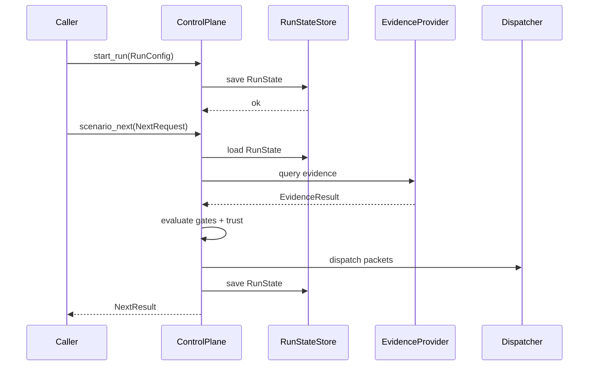

<!--
decision-gate-core README
============================================================================
Document: Decision Gate Core Library
Description: Deterministic checkpoint and requirement-evaluation engine.
Purpose: Core runtime, schemas, and runpack tooling for Decision Gate.
Dependencies:
  - ../../README.md (Decision Gate overview)
  - ../../Docs/architecture/decision_gate_scenario_state_architecture.md
  - ../../Docs/architecture/decision_gate_evidence_trust_anchor_architecture.md
  - ../../Docs/architecture/decision_gate_runpack_architecture.md
  - ../../Docs/security/threat_model.md
============================================================================
-->

# Decision Gate Core

Deterministic evaluation engine for Decision Gate. This crate defines the
canonical data model, trust enforcement, gate evaluation logic, and runpack
building utilities. Transport layers (MCP/HTTP) live elsewhere.

## Table of Contents

- [Overview](#overview)
- [Architecture](#architecture)
- [Core Capabilities](#core-capabilities)
- [Evidence Sourcing Model](#evidence-sourcing-model)
- [Module Structure](#module-structure)
- [API Reference](#api-reference)
- [Usage Examples](#usage-examples)
- [Testing](#testing)
- [Relationship to RET Logic](#relationship-to-ret-logic)
- [References](#references)

## Overview

`decision-gate-core` is the deterministic control plane. It:

- Evaluates gates using RET logic and comparators.
- Enforces trust lanes (`verified` vs `asserted`).
- Records run state and decisions for audit and replay.
- Builds runpacks for offline verification.

It does not provide transports or persistence implementations. Those are
supplied via traits (`EvidenceProvider`, `RunStateStore`, `Dispatcher`,
`ArtifactSink`, `DataShapeRegistry`).

## Architecture



## Core Capabilities

- **Gate evaluation**: RET trees with tri-state logic and comparator rules.
- **Trust lanes**: gate/condition enforcement of verified vs asserted evidence.
- **Run state**: deterministic state transitions and audit logs.
- **Runpacks**: deterministic manifest + artifact bundles.
- **Schema registry interfaces**: trait definitions used by MCP tooling.

## Evidence Sourcing Model

The core evaluates evidence in three modes:

1. **Provider-pulled evidence** (live runs): fetched via `EvidenceProvider`.
2. **Asserted evidence** (precheck): caller supplies `EvidenceResult` values.
3. **Submissions** (`scenario_submit`): stored for audit, not gate evaluation.

Schema validation and asserted payload ingestion live in the MCP layer.

## Module Structure

- `core/` - scenario specs, run state, evidence types, hashing
- `interfaces/` - traits for providers, dispatchers, stores
- `runtime/` - control plane engine, gate evaluation, runpack builder

## API Reference

### ControlPlane

Constructed with a single `ScenarioSpec` and trait implementations:

```rust
use decision_gate_core::runtime::ControlPlane;
use decision_gate_core::runtime::ControlPlaneConfig;

let control_plane = ControlPlane::new(
    scenario_spec,
    evidence_provider,
    dispatcher,
    run_state_store,
    None, // Optional PolicyDecider
    ControlPlaneConfig::default(),
)?;
```

Key methods:
- `start_run(run_config, started_at, dispatch_initial)`
- `scenario_status(status_request)`
- `scenario_next(next_request)`
- `scenario_submit(submit_request)`
- `trigger(trigger_event)`
- `precheck(precheck_request)`

### EvidenceProvider

```rust
use decision_gate_core::{EvidenceProvider, EvidenceQuery, EvidenceResult, EvidenceContext};

impl EvidenceProvider for MyProvider {
    fn query(&self, query: &EvidenceQuery, ctx: &EvidenceContext)
        -> Result<EvidenceResult, decision_gate_core::EvidenceError> {
        // fetch evidence and return EvidenceResult
    }

    fn validate_providers(&self, _spec: &ScenarioSpec)
        -> Result<(), decision_gate_core::ProviderMissingError> {
        Ok(())
    }
}
```

### Dispatcher

```rust
use decision_gate_core::{Dispatcher, DispatchTarget, PacketEnvelope, PacketPayload};

impl Dispatcher for MyDispatcher {
    fn dispatch(
        &self,
        target: &DispatchTarget,
        envelope: &PacketEnvelope,
        payload: &PacketPayload,
    ) -> Result<decision_gate_core::DispatchReceipt, decision_gate_core::DispatchError> {
        // deliver packet
    }
}
```

### RunStateStore

```rust
use decision_gate_core::{RunStateStore, RunState, RunId, TenantId, NamespaceId};

impl RunStateStore for MyStore {
    fn load(
        &self,
        tenant_id: &TenantId,
        namespace_id: &NamespaceId,
        run_id: &RunId,
    ) -> Result<Option<RunState>, decision_gate_core::StoreError> {
        // load state
    }

    fn save(&self, state: &RunState) -> Result<(), decision_gate_core::StoreError> {
        // save state
    }
}
```

## Usage Examples

### Basic Scenario Execution (Abridged)

```rust
use decision_gate_core::*;
use decision_gate_core::runtime::*;

let spec = build_spec(); // ScenarioSpec
let control_plane = ControlPlane::new(spec, provider, dispatcher, store, None, ControlPlaneConfig::default())?;

let run_state = control_plane.start_run(
    RunConfig {
        tenant_id: TenantId::from_raw(1).expect("nonzero tenantid"),
        namespace_id: NamespaceId::from_raw(1).expect("nonzero namespaceid"),
        run_id: RunId::new("run-1"),
        scenario_id: ScenarioId::new("scenario"),
        dispatch_targets: vec![],
        policy_tags: vec![],
    },
    Timestamp::Logical(1),
    false,
)?;

let next = control_plane.scenario_next(&NextRequest {
    tenant_id: run_state.tenant_id.clone(),
    namespace_id: run_state.namespace_id.clone(),
    run_id: run_state.run_id.clone(),
    trigger_id: TriggerId::new("trigger-1"),
    agent_id: "agent-1".to_string(),
    time: Timestamp::Logical(2),
    correlation_id: None,
})?;
```

### Precheck (Asserted Evidence)

```rust
use decision_gate_core::{EvidenceResult, EvidenceValue, TrustLane};
use decision_gate_core::runtime::PrecheckRequest;
use serde_json::json;

let mut evidence = std::collections::BTreeMap::new();
evidence.insert(
    "deploy_env".into(),
    EvidenceResult {
        value: Some(EvidenceValue::Json(json!("production"))),
        lane: TrustLane::Asserted,
        error: None,
        evidence_hash: None,
        evidence_ref: None,
        evidence_anchor: None,
        signature: None,
        content_type: Some("application/json".to_string()),
    },
);

let result = control_plane.precheck(&PrecheckRequest {
    stage_id: None,
    evidence,
})?;
```

### Runpack Build + Verify (Abridged)

```rust
use decision_gate_core::runtime::{RunpackBuilder, RunpackVerifier};

let manifest = RunpackBuilder::default()
    .build(&mut artifact_sink, &spec, &run_state, Timestamp::Logical(3))?;

let report = RunpackVerifier::verify_manifest(&manifest, &artifact_reader)?;
```

## Testing

```bash
cargo test -p decision-gate-core
```

## Relationship to RET Logic

Decision Gate uses `ret-logic` as its requirement algebra engine. RET evaluates
boolean and tri-state requirement trees; Decision Gate supplies domain semantics
(evidence, trust, disclosure, runpacks).

See `../ret-logic/README.md` for RET implementation details.

## References

JILUKA. (2023). _VENΦM_ [Audio recording]. YouTube. https://www.youtube.com/watch?v=psEMRalCPFQ

Shadow of Intent. (2024). _Flying The Black Flag_ [Audio recording]. YouTube. https://www.youtube.com/watch?v=GRBOrXvRiSc

Brand of Sacrifice. (2022). _Exodus_ [Audio recording]. YouTube. https://www.youtube.com/watch?v=yoXX7_pMJdU

Synestia. (2025). _Premonitions_ [Audio recording]. YouTube. https://www.youtube.com/watch?v=uukNqkWc4BU

A Night In Texas. (2017). _Population Extermination_ [Audio recording]. YouTube. https://www.youtube.com/watch?v=OObnE2KtBZU

Zebrahead. (2009). _Girlfriend_ [Audio recording]. YouTube. https://www.youtube.com/watch?v=V6LLSgyd7Cw
