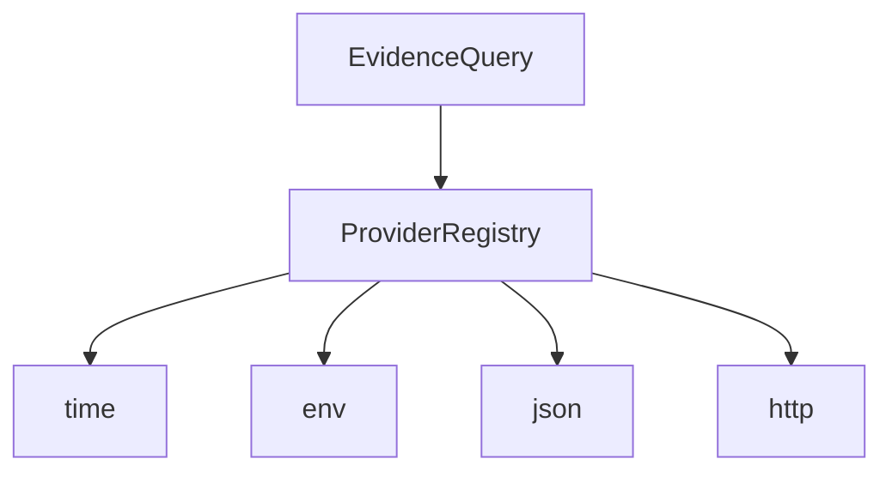

<!--
Decision Gate Providers README
============================================================================
Document: decision-gate-providers
Description: Built-in evidence providers for Decision Gate.
Purpose: Provide deterministic, auditable checks for common sources.
Dependencies:
  - ../../README.md (Decision Gate overview)
  - ../decision-gate-core/README.md
  - ../../Docs/configuration/decision-gate.toml.md
============================================================================
-->

# decision-gate-providers

Built-in evidence providers for Decision Gate. These providers are deterministic
and constrained by strict input validation and size limits.

## Table of Contents

- [Overview](#overview)
- [Architecture](#architecture)
- [Built-in Providers](#built-in-providers)
  - [time](#time)
  - [env](#env)
  - [json](#json)
  - [http](#http)
- [Provider Contracts](#provider-contracts)
- [Usage Examples](#usage-examples)
- [Security Model](#security-model)
- [Testing](#testing)
- [References](#references)

## Overview

The built-in providers cover the most common evidence sources:

- **time**: checks derived from the trigger timestamp.
- **env**: environment variable lookups with allow/deny policy.
- **json**: JSON/YAML file reads with optional JSONPath selection.
- **http**: bounded HTTP GET checks (status and body hash).

Provider identifiers are reserved for built-ins, and the registry rejects duplicate
registrations to prevent silent overrides.

These providers are used directly by `decision-gate-mcp` and can also be
embedded in custom control-plane integrations.

## Architecture



## Built-in Providers

### time

Checks:
- `now`: return the trigger timestamp.
- `after`: return true if trigger time is after a threshold.
- `before`: return true if trigger time is before a threshold.

Params:

```json
{ "timestamp": 1710000000000 }
```

or:

```json
{ "timestamp": "2024-01-01T00:00:00Z" }
```

Config (in `decision-gate.toml`):
- `allow_logical` (bool, default true)

### env

Check:
- `get`: fetch an environment variable value.

Params:

```json
{ "key": "DEPLOY_ENV" }
```

Config:
- `allowlist` (array, optional)
- `denylist` (array)
- `max_value_bytes` (integer)
- `max_key_bytes` (integer)
- `overrides` (table, optional deterministic overrides)

Missing keys return `null` values; blocked keys return provider errors.

### json

Check:
- `path`: read a JSON/YAML file and optionally select a JSONPath.

Params:

```json
{ "file": "file.json", "jsonpath": "$.summary.failed" }
```

Config:
- `root` (string, required root directory)
- `root_id` (string, required stable identifier)
- `max_bytes` (integer)
- `allow_yaml` (bool)

File paths are **relative** to `root`; absolute paths are rejected. JSONPath
misses return an error result with a `jsonpath_not_found` code.

### http

Checks:
- `status`: return HTTP status code.
- `body_hash`: return a hash of the response body.

Params:

```json
{ "url": "https://api.example.com/health" }
```

Config:
- `allow_http` (bool, default false)
- `timeout_ms` (integer)
- `max_response_bytes` (integer)
- `allowed_hosts` (array, optional allowlist)
- `user_agent` (string)
- `hash_algorithm` (string, default sha256)

Redirects are not followed.

## Provider Contracts

Provider contracts are generated by `decision-gate-contract` and exposed via:

- `Docs/generated/decision-gate/providers.json`
- MCP tools: `provider_contract_get` and `provider_check_schema_get`

## Usage Examples

Time-based gate:

```json
{
  "condition_id": "deployment_window",
  "query": {
    "provider_id": "time",
    "check_id": "after",
    "params": { "timestamp": "2024-03-10T02:00:00Z" }
  },
  "comparator": "equals",
  "expected": true
}
```

JSON artifact gating:

```json
{
  "condition_id": "tests_passed",
  "query": {
    "provider_id": "json",
    "check_id": "path",
    "params": { "file": "test-results.json", "jsonpath": "$.summary.failed" }
  },
  "comparator": "equals",
  "expected": 0
}
```

HTTP health check:

```json
{
  "condition_id": "api_ok",
  "query": {
    "provider_id": "http",
    "check_id": "status",
    "params": { "url": "https://api.example.com/health" }
  },
  "comparator": "equals",
  "expected": 200
}
```

## Security Model

- **Fail closed**: invalid params or I/O errors yield evidence errors.
- **Size limits**: enforced on files and HTTP responses.
- **Scheme restrictions**: HTTP provider blocks cleartext unless `allow_http`.
- **Deterministic hashing**: evidence is normalized before hashing in core.

See `../../Docs/security/threat_model.md` for system-level assumptions.

## Testing

```bash
cargo test -p decision-gate-providers
```

## References

The Gloom In The Corner. (2019). _Misanthropic_ [Audio recording]. YouTube. https://www.youtube.com/watch?v=czoneUVvbxw

Northern Lights. (2025). _ILTB_ [Audio recording]. YouTube. https://www.youtube.com/watch?v=xq69OPrc1K0
