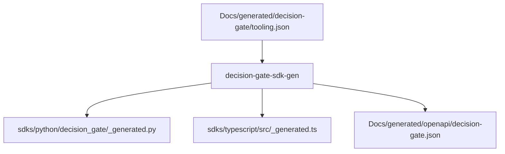

<!--
Decision Gate SDK Generator README
============================================================================
Document: decision-gate-sdk-gen
Description: Deterministic SDK + OpenAPI generator for Decision Gate.
Purpose: Generate client SDK artifacts from tooling.json.
Dependencies:
  - ../../README.md (Decision Gate overview)
  - ../decision-gate-contract/README.md
  - ../../Docs/generated/decision-gate/tooling.json
  - ../../Docs/security/threat_model.md
============================================================================
-->

# decision-gate-sdk-gen

Deterministic SDK and OpenAPI generator for Decision Gate. This crate renders
Python/TypeScript client surfaces and an OpenAPI JSON view from the canonical
`tooling.json` contract.

## Table of Contents

- [Overview](#overview)
- [Architecture](#architecture)
- [Generated Artifacts](#generated-artifacts)
- [Usage](#usage)
- [Documentation](#documentation)
- [Testing](#testing)
- [References](#references)

## Overview

`decision-gate-sdk-gen` reads the generated tooling contract and produces:

- Python SDK bindings for the Decision Gate MCP surface.
- TypeScript SDK bindings for the same contract.
- An OpenAPI JSON view for tooling-aligned integrations.

All outputs are deterministic for a fixed tooling contract.

## Architecture



## Generated Artifacts

- `sdks/python/decision_gate/_generated.py`
- `sdks/typescript/src/_generated.ts`
- `Docs/generated/openapi/decision-gate.json`

## Usage

Generate SDK artifacts using the default paths:

```bash
cargo run -p decision-gate-sdk-gen -- generate
```

Verify generated outputs match the repository:

```bash
cargo run -p decision-gate-sdk-gen -- check
```

## Documentation

- `Docs/generated/decision-gate/tooling.json`
- `Docs/generated/openapi/decision-gate.json`
- `Docs/security/threat_model.md`

## Testing

```bash
cargo test -p decision-gate-sdk-gen
```

## References

- `Docs/generated/decision-gate/tooling.json`
- `Docs/generated/openapi/decision-gate.json`
- `Docs/security/threat_model.md`
- `../decision-gate-contract/README.md`
