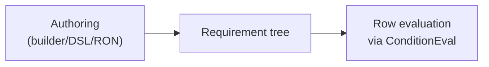

# RET Logic (Requirement Evaluation Tree)

[](../LICENSE)
[](../rust-toolchain.toml)
[](Cargo.toml)

Crate: [`ret-logic`](Cargo.toml)

RET stands for **Requirement Evaluation Tree**. (Canonical) Alternative forms: RET Trees/RETT.

> **"I ABSTRACT, I ABSTRACT SOME MORE.
> I'M SUPPOSED TO STOP BUT I CAN'T."**
>
> - _Michael "Yung Bidness" Campbell, in reverence of Roy Jones Jr., on the eternal return of recursive formalism and falsity of premature abstraction_

A domain-agnostic requirement evaluation engine that separates propositional
logic (AND/OR/NOT/RequireGroup) from condition semantics. It provides a small
core for evaluating requirements against user-defined conditions and readers.

This crate comes from an attempt to derive the general class structure of "quests" for video games. At their core, quests ultimately culminate in the condition "Has X been done?"; given the data-driven nature of those systems, we can generalize "X" to be "any data source." Structurally, ["Kill five shidar at the behest of Arx the Purifier"](https://yungbidness.dev/#future) is the same as "Did the football/soccer team in Barcelona score more than its opponent?" In both cases we can strip out the surrounding context and focus purely on the operative condition.

Hence this crate.

That said, this crate exists because of my frustration with recreating the same mathematical form - if you're just doing `if (x && y)`, you probably don't need this crate (as much as you might want it...).

## Status and Scope

RET Logic is the universal condition algebra used by Decision Gate. It provides
deterministic boolean and tri-state evaluation over domain-defined conditions.

In scope:

- Algebraic requirement trees (AND/OR/NOT/RequireGroup).
- Deterministic evaluation and traceability hooks.
- Lightweight DSL and validation helpers.

Out of scope:

- Domain semantics (providers, evidence, runpacks).
- Policy or trust-lane enforcement (lives in Decision Gate core).

## Table of Contents

- [Overview](#overview)
- [Repository Note](#repository-note)
- [Architecture](#architecture)
- [Quick Start](#quick-start)
- [Installation](#installation)
- [Core Concepts](#core-concepts)
- [Domain Integration](#domain-integration)
- [Plan Execution](#plan-execution)
- [Module Structure](#module-structure)
- [License](#license)
- [Author's Note](#authors-note)
- [References](#references)

## Overview

RET models requirements as trees of logical operators over domain conditions.
Evaluation is performed by calling user-provided condition logic against a
reader type that exposes domain data. The library does not define what a
condition means; you do.

## Repository Note

`ret-logic` is designed to be a standalone, publishable crate. It currently
lives inside the Decision Gate repository for convenience while the OSS stack
stabilizes. Treat it as its own crate: it has its own `Cargo.lock`, does not
require Decision Gate dependencies, and can be used independently.

Status: **pre-1.0**. The API may change while Decision Gate dogfoods this crate,
and no backward-compatibility guarantees are made until a standalone release.

## Architecture



## Quick Start

```rust
use ret_logic::{Requirement, ConditionEval};

#[derive(Clone)]
enum GameCondition {
    HealthGte(f32),
    HasFlag(u64),
}

struct UnitReader<'a> {
    health: &'a [f32],
    flags: &'a [u64],
}

impl ConditionEval for GameCondition {
    type Reader<'a> = UnitReader<'a>;

    fn eval_row(&self, reader: &Self::Reader<'_>, row: usize) -> bool {
        match self {
            GameCondition::HealthGte(threshold) => reader.health[row] >= *threshold,
            GameCondition::HasFlag(flag) => (reader.flags[row] & flag) != 0,
        }
    }
}

let requirement = Requirement::and(vec![
    Requirement::condition(GameCondition::HealthGte(50.0)),
    Requirement::condition(GameCondition::HasFlag(0b0100)),
]);

let reader = UnitReader { health: &health_slice, flags: &flags_slice };
let passes = requirement.eval(&reader, 0);
```

## Installation

Add to your `Cargo.toml`:

```toml
[dependencies]
ret-logic = { path = "../ret-logic" } # workspace usage
# ret-logic = "0.1" # published crate
```

Minimum Supported Rust Version: 1.92 (matches `rust-toolchain.toml`)

Dependencies: `serde`, `smallvec`, `ron`, `serde_json`

## Core Concepts

### Requirement Algebra

The `Requirement<P>` enum provides domain-agnostic boolean operations:

- **AND**: All children must pass
- **OR**: Any child must pass
- **NOT**: Inverts the result
- **RequireGroup**: At least N of M must pass

```rust
pub enum Requirement<P> {
    And(SmallVec<[Box<Self>; 4]>),
    Or(SmallVec<[Box<Self>; 4]>),
    Not(Box<Self>),
    RequireGroup { min: u8, reqs: SmallVec<[Box<Self>; 8]> },
    Condition(P),
}
```

### Tri-State Evaluation

For evidence-driven systems, boolean evaluation may be insufficient. RET
supports tri-state evaluation (`true/false/unknown`) with configurable logic
modes (Kleene and Bochvar).

### ConditionEval Trait

Conditions are evaluated against a reader type defined by the domain:

```rust
pub trait ConditionEval {
    type Reader<'a>;

    fn eval_row(&self, reader: &Self::Reader<'_>, row: usize) -> bool;
}

pub trait BatchConditionEval: ConditionEval {
    fn eval_block(&self, reader: &Self::Reader<'_>, start: usize, count: usize) -> u64 {
        // Default: scalar evaluation; domains can override
    }
}
```

## Domain Integration

1. Define a reader type that exposes the data needed for conditions.
2. Define condition types for your domain.
3. Implement `ConditionEval` (and optionally `BatchConditionEval`).
4. Build requirements using the builder API, the DSL, or RON.

Authoring options:

- **RON files** via `ret_logic::serde_support::convenience`.
- **Builder API** via `ret_logic::builder::RequirementBuilder`.
- **DSL** via `ret_logic::parse_requirement`.

## Plan Execution

RET includes a plan/executor layer for domains that want to compile requirements
into opcode sequences and evaluate them via a dispatch table. This is optional
and domain-defined.

```rust
use ret_logic::{PlanBuilder, PlanExecutor, OpCode, build_dispatch_table};

let plan = PlanBuilder::new()
    .add_op(OpCode::AndStart, 0, 0, 0)
    .add_op(OpCode::AndEnd, 0, 0, 0)
    .build();

let table = build_dispatch_table!(
    MyReader,
    OpCode::AndStart => my_handler,
    OpCode::AndEnd => my_handler,
);

let executor = PlanExecutor::new(plan, table);
let passes = executor.eval_row(&reader, 0);
```

Operands in `add_op` are domain-defined indices. The executor invokes handlers
registered in the dispatch table.

## Module Structure

- **[requirement.rs](src/requirement.rs)** - Core `Requirement<P>` enum
- **[traits.rs](src/traits.rs)** - Condition and reader traits
- **[plan.rs](src/plan.rs)** - Plan structures and opcodes
- **[executor.rs](src/executor.rs)** - Plan execution engine and dispatch helper
- **[tristate.rs](src/tristate.rs)** - Tri-state logic and traces
- **[dsl.rs](src/dsl.rs)** - Lightweight DSL parser
- **[builder.rs](src/builder.rs)** - Requirement builder API
- **[serde_support.rs](src/serde_support.rs)** - RON/JSON authoring helpers

## License

Apache 2.0. See `../LICENSE`.

## Author's Note

I built this system because I kept running into the same problem: evaluating complex boolean conditions over thousands of game entities, and watching naive implementations become bottlenecks. The insight that boolean algebra is universal - that AND/OR/NOT never change regardless of domain - led to this separation of concerns.

The mathematical approach here is sound. I'm confident in the architecture: universal logic at the top, domain-specific optimization at the condition boundary, and zero-allocation evaluation in the hot path.

That said, I'm still deepening my understanding of low-level optimization. I look forward to experimenting with hand-tuned SIMD implementations, formal benchmarking against alternative approaches, and exploring edge cases as time permits. If you find issues or have suggestions, I'd genuinely appreciate the feedback.

- Michael "Yung Bidness" Campbell, as seen by an LLM.

P.S. The above author's note was written by an LLM. I'm a bit strapped for time right now, but in the future (hopefully) I'll come back to this and write a TRULY heartfelt message. Assuming, of course, I'm not distracted by ABSTRACTING SOME MORE.

## References

Roy Jones Jr. (2004). _I Smoke, I Drank_ [Audio recording]. YouTube. https://www.youtube.com/watch?v=8sLtXWtcGkM

Abbie Falls. (2025). _Victim_ [Audio recording]. YouTube. https://www.youtube.com/watch?v=HkEZHmUq5AI
