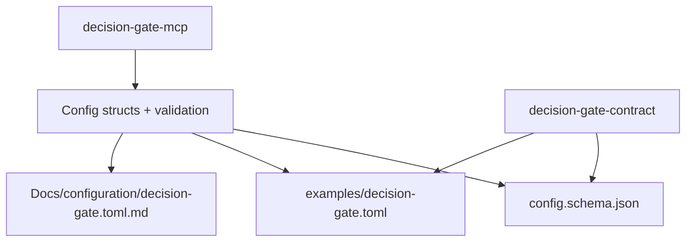

<!--
decision-gate-config README
============================================================================
Document: decision-gate-config
Description: Canonical config model, validation, and artifact generation.
Purpose: Single source of truth for Decision Gate configuration semantics.
Dependencies:
  - ../../README.md (Decision Gate overview)
  - ../../Docs/configuration/decision-gate.toml.md
  - ../../Docs/roadmap/decision_gate_config_single_source_plan.md
  - ../../Docs/architecture/decision_gate_auth_disclosure_architecture.md
  - ../../Docs/architecture/decision_gate_namespace_registry_rbac_architecture.md
  - ../../Docs/architecture/decision_gate_provider_capability_architecture.md
  - ../../Docs/architecture/comparator_validation_architecture.md
  - ../../Docs/security/threat_model.md
============================================================================
-->

# decision-gate-config

Canonical configuration model and generators for Decision Gate. This crate
owns config structs, defaults, and validation, and emits deterministic schema,
examples, and docs used by MCP, SDK tooling, and the website.

## Table of Contents

- [Overview](#overview)
- [Architecture](#architecture)
- [Generated Artifacts](#generated-artifacts)
- [Usage](#usage)
- [Integration with Other Crates](#integration-with-other-crates)
- [Documentation](#documentation)
- [Testing](#testing)
- [References](#references)

## Overview

`decision-gate-config` is the single source of truth for:

- Config parsing and validation (fail-closed).
- JSON schema generation for `decision-gate.toml`.
- Canonical TOML example configuration.
- Markdown documentation for configuration fields.

## Architecture



## Generated Artifacts

- `Docs/generated/decision-gate/schemas/config.schema.json`
- `Docs/generated/decision-gate/examples/decision-gate.toml`
- `Docs/configuration/decision-gate.toml.md`

## Usage

Generation is typically orchestrated by the contract CLI:

```bash
cargo run -p decision-gate-contract -- generate
```

Verification (drift check):

```bash
cargo run -p decision-gate-contract -- check
```

## Integration with Other Crates

- **decision-gate-mcp**: uses config structs and validation directly.
- **decision-gate-contract**: consumes schema/example/docs generators.
- **Docs/website**: reads generated configuration docs for user guidance.

## Documentation

- `Docs/configuration/decision-gate.toml.md`
- `Docs/roadmap/decision_gate_config_single_source_plan.md`
- `Docs/security/threat_model.md`

## Testing

```bash
cargo test -p decision-gate-config
cargo run -p decision-gate-contract -- check
```

## References

Motionless in White. (2026). _Afraid of the Dark_ [Audio recording]. YouTube. https://www.youtube.com/watch?v=jolaO2Z6xCM

Motionless in White. (2017). _570_ [Audio recording]. YouTube. https://www.youtube.com/watch?v=7Na3sECLYI8
