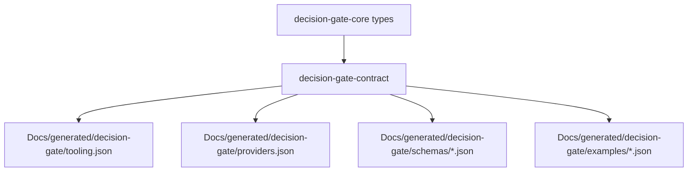

<!--
Decision Gate Contract README
============================================================================
Document: decision-gate-contract
Description: Canonical schemas, tooling, and examples for Decision Gate.
Purpose: Single source of truth for MCP tool contracts and JSON schemas.
Dependencies:
  - ../../README.md (Decision Gate overview)
  - ../decision-gate-core/README.md
  - ../../Docs/architecture/decision_gate_provider_capability_architecture.md
============================================================================
-->

# decision-gate-contract

Canonical contract definitions and schema generation for Decision Gate. This
crate generates MCP tool schemas, provider contracts, and validated examples
from Rust source to keep runtime behavior and documentation aligned.

## Table of Contents

- [Overview](#overview)
- [Architecture](#architecture)
- [Generated Artifacts](#generated-artifacts)
- [Usage](#usage)
- [Integration with Other Crates](#integration-with-other-crates)
- [Testing](#testing)
- [References](#references)

## Overview

`decision-gate-contract` is the source of truth for:

- MCP tool schemas (`tools/list` and `tools/call`).
- Provider capability contracts (predicates + params + result schemas).
- JSON schemas for Decision Gate types.
- Canonical examples validated against the schemas.

## Architecture



## Generated Artifacts

Artifacts live under `Docs/generated/decision-gate/`:

- `tooling.json` - array of MCP tool definitions (17 tools).
- `providers.json` - array of provider contracts (built-ins + metadata).
- `schemas/` - JSON schemas for scenario specs and runtime types.
- `examples/` - validated example payloads.

Example structure (tooling.json):

```json
[
  {
    "name": "scenario_define",
    "description": "Register a ScenarioSpec and return its canonical hash.",
    "input_schema": { "type": "object" },
    "output_schema": { "type": "object" }
  }
]
```

## Usage

Generate contracts:

```bash
cargo run -p decision-gate-contract -- generate
```

Verify that generated artifacts are up to date:

```bash
cargo run -p decision-gate-contract -- check
```

## Integration with Other Crates

- **decision-gate-core**: supplies type definitions used by the generator.
- **decision-gate-mcp**: consumes `tooling.json` and provider contracts.
- **decision-gate-providers**: must conform to provider contracts.
- **Docs/SDKs**: consume generated schemas and examples.

## Testing

```bash
cargo test -p decision-gate-contract
cargo test -p decision-gate-contract --test schema_validation
cargo test -p decision-gate-mcp --test contract_schema_e2e
```

## References

Zélie. (2025). _JE NE SERAI JAMAIS_ [Audio recording]. YouTube. https://www.youtube.com/watch?v=77FsRoi3yqU

Kyo. (2003). _Dernière danse_ [Audio recording]. YouTube. https://www.youtube.com/watch?v=aU_TQcyGkvY

Jasmina Oder. (2025). _SAG NICHT DU LIEBST MICH_ [Audio recording]. YouTube. https://www.youtube.com/watch?v=AMwnlAhkFX4
