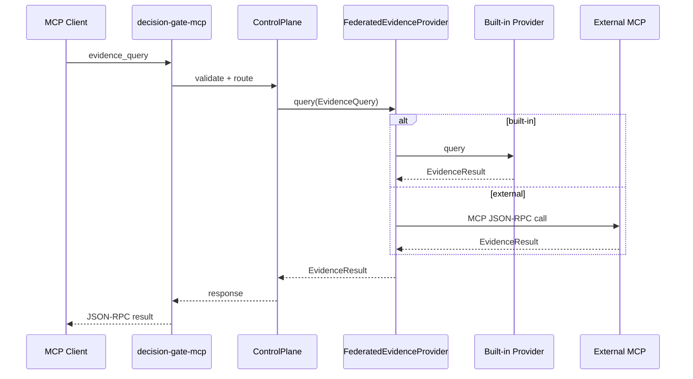

<!--
Decision Gate MCP README
============================================================================
Document: decision-gate-mcp
Description: MCP server and evidence federation for Decision Gate.
Purpose: Expose the Decision Gate control plane over JSON-RPC 2.0.
Dependencies:
  - ../../README.md (Decision Gate overview)
  - ../decision-gate-core/README.md
  - ../../Docs/configuration/decision-gate.toml.md
  - ../../Docs/security/threat_model.md
============================================================================
-->

# decision-gate-mcp

MCP server and evidence federation layer for Decision Gate. Exposes the control
plane as JSON-RPC 2.0 tools over stdio, HTTP, or SSE.

## Table of Contents

- [Overview](#overview)
- [Architecture](#architecture)
- [MCP Tool Surface](#mcp-tool-surface)
- [Transports](#transports)
- [Evidence Federation](#evidence-federation)
- [Configuration](#configuration)
- [Usage Examples](#usage-examples)
- [Current Limits](#current-limits)
- [Testing](#testing)
- [References](#references)

## Overview

`decision-gate-mcp` is the canonical tool surface for Decision Gate. It provides
scenario lifecycle tools, evidence queries, schema registry access, precheck,
and runpack operations. The core evaluation logic lives in
`decision-gate-core`; this crate is a transport and policy layer.

## Architecture

```mermaid
flowchart TB
  Client[MCP client] --> Transport[Transport: stdio/HTTP/SSE]
  Transport --> Auth[Auth + policy]
  Auth --> Tools[Tool router (17 tools)]

  Tools --> Core[ControlPlane]
  Tools --> Registry[Schema registry]
  Tools --> Evidence[Federated evidence provider]

  Evidence --> Builtins[Built-in providers]
  Evidence --> External[External MCP providers]

  Core --> Store[RunStateStore]
  Core --> Dispatcher[Dispatcher]
```

## MCP Tool Surface

Tool definitions are generated in `Docs/generated/decision-gate/tooling.json`.
The tool list includes:

- Scenario lifecycle: `scenario_define`, `scenario_start`, `scenario_status`,
  `scenario_next`, `scenario_submit`, `scenario_trigger`, `scenarios_list`
- Evidence and providers: `evidence_query`, `providers_list`,
  `provider_contract_get`, `provider_schema_get`
- Schema registry: `schemas_register`, `schemas_list`, `schemas_get`
- Runpacks: `runpack_export`, `runpack_verify`
- Precheck: `precheck`

## Transports

- **Stdio**: Content-Length framing over stdin/stdout.
- **HTTP**: JSON-RPC 2.0 via `POST /rpc`.
- **SSE**: JSON-RPC 2.0 via `POST /rpc`, responses returned as SSE events.

## Evidence Federation

Evidence queries are routed to built-in providers or external MCP providers
based on the provider registry in `decision-gate.toml`.



## Configuration

`decision-gate.toml` is the authoritative configuration format. See
`Docs/configuration/decision-gate.toml.md` for full details.

Minimal HTTP server example:

```toml
[server]
transport = "http"
bind = "127.0.0.1:8080"
max_body_bytes = 1048576

[server.auth]
mode = "bearer_token"
bearer_tokens = ["token-1"]
allowed_tools = ["scenario_define", "scenario_start", "scenario_next"]

[server.limits]
max_inflight = 100
```

Provider registration:

```toml
[[providers]]
name = "time"
type = "builtin"

[[providers]]
name = "custom"
type = "mcp"
command = ["python", "provider.py"]
capabilities_path = "contracts/custom_provider.json"
```

Evidence disclosure policy (raw values via `evidence_query`):

```toml
[evidence]
allow_raw_values = false
require_provider_opt_in = true
```

## Usage Examples

Start the MCP server:

```bash
cargo run -p decision-gate-cli -- serve --config decision-gate.toml
```

Make an HTTP JSON-RPC call:

```bash
curl -X POST http://127.0.0.1:8080/rpc \
  -H "Authorization: Bearer token-1" \
  -H "Content-Type: application/json" \
  -d '{"jsonrpc":"2.0","id":1,"method":"tools/list"}'
```

## Current Limits

- External MCP provider retries are not built in.
- Evidence raw values are redacted by default unless explicitly enabled.
- SSE responses are delivered as single-event streams (one response per request).

## Testing

```bash
cargo test -p decision-gate-mcp
cargo test -p decision-gate-mcp --test contract_schema_e2e
```

## References

Abandon All Ships. (2016). _Loafting_ [Audio recording]. YouTube. https://www.youtube.com/watch?v=V6CiT1tGUMg

Secrets. (2019). _My Mind, Myself & I_ [Audio recording]. YouTube. https://www.youtube.com/watch?v=51xzsGkQIcQ

Secrets. (2022). _Parasite_ [Audio recording]. YouTube. https://www.youtube.com/watch?v=c3o_pLDmdVM
