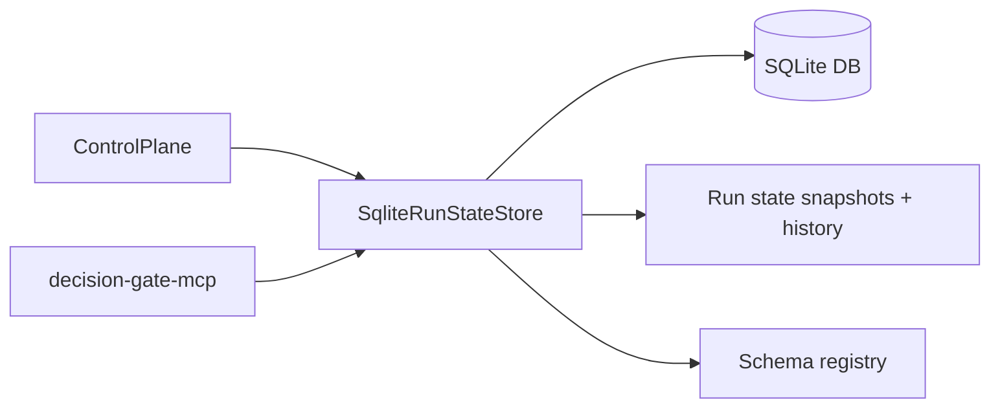

<!--
Decision Gate SQLite Store README
============================================================================
Document: decision-gate-store-sqlite
Description: SQLite-backed run state store and schema registry.
Purpose: Provide durable persistence for Decision Gate core and MCP.
Dependencies:
  - ../../README.md (Decision Gate overview)
  - ../decision-gate-core/README.md
  - ../../Docs/configuration/decision-gate.toml.md
============================================================================
-->

# decision-gate-store-sqlite

SQLite-backed implementations of `RunStateStore` and `DataShapeRegistry` for
Decision Gate. This crate provides durable run state snapshots, version history,
and a persistent schema registry in a single SQLite database.

## Table of Contents

- [Overview](#overview)
- [Architecture](#architecture)
- [Configuration](#configuration)
- [Usage](#usage)
- [Operational Notes](#operational-notes)
- [Testing](#testing)
- [References](#references)

## Overview

`decision-gate-store-sqlite` is the default durable backend for OSS deployments.
It stores:

- Run state snapshots and version history (for replay/audit).
- Schema registry entries for asserted data shapes.

The store enforces size limits and validates canonical hashes on load to preserve
determinism and auditability.

## Architecture



## Configuration

`decision-gate.toml` configures the store for both run state and schema registry.

```toml
[run_state_store]
type = "sqlite"
path = "decision-gate.db"
journal_mode = "wal"
sync_mode = "full"
busy_timeout_ms = 5000
max_versions = 1000

[schema_registry]
type = "sqlite"
path = "decision-gate.db"
journal_mode = "wal"
sync_mode = "full"
busy_timeout_ms = 5000
max_schema_bytes = 1048576
max_entries = 1000
```

See `Docs/configuration/decision-gate.toml.md` for full config options.

## Usage

Direct use from Rust (most deployments should prefer MCP wiring):

```rust
use decision_gate_store_sqlite::{SqliteRunStateStore, SqliteStoreConfig};

let store = SqliteRunStateStore::new(SqliteStoreConfig {
    path: "decision-gate.db".into(),
    busy_timeout_ms: 5000,
    journal_mode: Default::default(),
    sync_mode: Default::default(),
    max_versions: Some(1000),
})?;
```

The same `SqliteRunStateStore` instance implements both `RunStateStore` and
`DataShapeRegistry` traits.

## Operational Notes

- **Size limits**: run state snapshots are capped at 16 MiB; schemas are capped
  at 1 MiB.
- **Journal mode**: WAL is the default and recommended setting.
- **Concurrency**: uses SQLite busy timeouts to avoid immediate lock failures.

## Testing

```bash
cargo test -p decision-gate-store-sqlite
```

## References

