# RET Logic (Requirement Evaluation Tree)

[](../LICENSE)
[](../rust-toolchain.toml)

Crate: [`ret-logic`](Cargo.toml)

RET stands for **Requirement Evaluation Tree**.

> **"I ABSTRACT, I ABSTRACT SOME MORE.
> I'M SUPPOSED TO STOP BUT I CAN'T."**
> — _Michael "Yung Bidness" Campbell, in reverence of Roy Jones Jr., on the eternal return of recursive formalism and falsity of premature abstraction_

A universal predicate evaluation engine that separates boolean algebra from domain semantics, enabling efficient row-based evaluation over ECS chunks.

## Table of Contents

- [Overview](#overview)
- [The Simple AF Pipeline](#the-simple-af-pipeline-architecture)
- [Quick Start](#quick-start)
- [Installation](#installation)
- [Core Concepts](#core-concepts)
- [Domain Integration](#domain-integration)
- [Performance](#performance)
- [Design Philosophy](#design-philosophy)
- [Module Structure](#module-structure)
- [License](#license)
- [Author's Note](#authors-note)
- [References](#references)

## Overview

**The Problem**: Evaluating complex boolean conditions over thousands of entities is a recurring challenge in game engines, simulations, and data processing. Naive approaches—walking abstract syntax trees entity-by-entity with hash lookups—quickly become bottlenecks.

**The Insight**: Boolean algebra is universal mathematics. AND, OR, NOT, and group operations never change regardless of what you're evaluating. By separating this universal structure from domain-specific predicate semantics, we can optimize each layer independently.

**The Solution**: A three-layer architecture that transforms human-readable conditions into cache-friendly, zero-allocation evaluation over contiguous memory.

This system enables:

- **Three-layer optimization**: Human-readable authoring → Compiled plans → Direct slice scanning
- **Row-based evaluation**: Direct `&[T]` slice access instead of entity-by-entity lookups
- **Universal abstractions**: Same logical operators work across any domain
- **SIMD-ready architecture**: Contiguous memory access patterns enable vectorization
- **Zero-allocation hot paths**: Direct array indexing with no hash lookups or dynamic dispatch

## The "Simple AF" Pipeline Architecture

```mermaid
flowchart LR
  A[RON Authoring<br/>🔤 Human-readable<br/>📝 Designer-friendly] --> B[Plan Compilation<br/>🔤→🔢 String to dense IDs<br/>📊 Column requirements<br/>⚡ Operation sequences]
  B --> C[Row Evaluation<br/>🏎️ Direct slice access<br/>📦 Cache-friendly<br/>🔢 SIMD-ready]

  style A fill:#e8f4fd
  style B fill:#fff2cc
  style C fill:#d5e8d4
```



### Layer 1: Human-Productive Authoring

**Optimized for:** Designer workflow, maintainability, iteration speed
**Performance:** Irrelevant—happens at development time
**Data format:** RON files with readable names and intuitive structures

```ron
// combat_requirements.ron - Completely human-readable
And([
    Predicate(HealthGte(50.0)),
    Predicate(HasProperty(CombatReady)),
    Or([
        Predicate(CapacitorGte(25.0)),
        Predicate(HasWeapon(Laser))
    ])
])
```

### Layer 2: Load-Time Compilation

**Optimized for:** One-time cost to enable runtime performance
**Performance:** Acceptable overhead during loading/startup
**Transformation:** Strings → Dense IDs, Requirements → Plans, Names → Column keys

```rust
// Compilation transforms human data into optimized runtime format
let plan = PlanBuilder::new()
    .and_start()
    .add_op(OpCode::FloatGte, HEALTH_COLUMN, health_threshold_idx, 0)
    .add_op(OpCode::HasAllFlags, FLAGS_COLUMN, combat_ready_idx, 0)
    .or_start()
    .add_op(OpCode::FloatGte, CAPACITOR_COLUMN, cap_threshold_idx, 0)
    .add_op(OpCode::HasAllFlags, WEAPON_COLUMN, laser_weapon_idx, 0)
    .or_end()
    .and_end()
    .build();
```

### Layer 3: Runtime Evaluation

**Optimized for:** Performance-critical hot paths
**Performance:** Direct array access; benchmark in your domain
**Data access:** Direct slice scanning with `reader.component[row]`

```rust
// Hot path: direct array access
fn eval_row<'a>(&self, reader: &ShipReader<'a>, row: usize) -> bool {
    reader.health[row] >= 50.0 &&
    (reader.flags[row] & COMBAT_READY) != 0 &&
    (reader.capacitor[row] >= 25.0 ||
     (reader.weapon_flags[row] & LASER_WEAPON) != 0)
}
```

## Quick Start

```rust
use ret_logic::{Requirement, PredicateEval};

// Define your domain predicate
#[derive(Clone)]
enum GamePredicate {
    HealthGte(f32),
    HasFlag(u64),
}

// Define your reader (references to component slices)
struct UnitReader<'a> {
    health: &'a [f32],
    flags: &'a [u64],
}

// Implement row-based evaluation
impl PredicateEval for GamePredicate {
    type Reader<'a> = UnitReader<'a>;

    fn eval_row(&self, reader: &Self::Reader<'_>, row: usize) -> bool {
        match self {
            GamePredicate::HealthGte(threshold) => reader.health[row] >= *threshold,
            GamePredicate::HasFlag(flag) => (reader.flags[row] & flag) != 0,
        }
    }
}

// Build and evaluate requirements
let requirement = Requirement::and(vec![
    Requirement::predicate(GamePredicate::HealthGte(50.0)),
    Requirement::predicate(GamePredicate::HasFlag(COMBAT_READY)),
]);

// Evaluate against your data
let reader = UnitReader { health: &health_slice, flags: &flags_slice };
let passes = requirement.eval(&reader, row_index);
```

## Installation

Add to your `Cargo.toml`:

```toml
[dependencies]
ret-logic = { path = "../ret-logic" } # workspace usage
# ret-logic = "0.1" # published crate
```

**Minimum Supported Rust Version:** 1.92 (edition 2024; matches [`rust-toolchain.toml`](../rust-toolchain.toml))

**Dependencies:** `serde`, `smallvec`, `ron`, `serde_json`

## Core Concepts

### Universal Boolean Algebra

The `Requirement<P>` enum provides domain-agnostic boolean operations:

- **AND**: All children must pass (short-circuits on first failure)
- **OR**: Any child must pass (short-circuits on first success)
- **NOT**: Inverts the result
- **RequireGroup**: At least N of M must pass (early exit when mathematically determined)

```rust
pub enum Requirement<P> {
    And(SmallVec<[Box<Self>; 4]>),
    Or(SmallVec<[Box<Self>; 4]>),
    Not(Box<Self>),
    RequireGroup { min: u8, reqs: SmallVec<[Box<Self>; 8]> },
    Predicate(P),
}
```

### Tri-State Evaluation (Evidence Gates)

For evidence-driven systems, boolean evaluation is not always sufficient. The requirements crate supports tri-state evaluation (`true/false/unknown`) with configurable logic tables:

- **Kleene logic** (recommended default): preserves "unknown" when evidence is insufficient
- **Bochvar logic** (optional): treats any unknown as infectious

Tri-state evaluation is opt-in and does not change the default boolean path.

### The PredicateEval Trait (Optimization Boundary)

All performance optimization happens at the predicate evaluation boundary:

```rust
pub trait PredicateEval {
    type Reader<'a>;

    #[inline(always)]
    fn eval_row<'a>(&self, reader: &Self::Reader<'a>, row: usize) -> bool;
}

pub trait BatchPredicateEval: PredicateEval {
    #[inline(always)]
    fn eval_block<'a>(&self, reader: &Self::Reader<'a>, start: usize, count: usize) -> u64 {
        // Default: scalar evaluation, domains can override with SIMD
    }
}
```

Domains control 100% of predicate evaluation. The requirement system handles control flow; you handle data access.

## Domain Integration

### 1. Define Your Reader Type

The Reader bundles component slices from an ECS chunk:

```rust
pub struct ShipReader<'a> {
    pub health: &'a [f32],
    pub capacitor: &'a [f32],
    pub flags: &'a [u64],
    pub positions: &'a [(f32, f32, f32)],
    pub entities: &'a [Entity],
}

impl<'a> ReaderLen for ShipReader<'a> {
    fn len(&self) -> usize { self.health.len() }
}
```

### 2. Define Your Predicate Types

```rust
#[derive(Debug, Clone, Copy, Serialize, Deserialize)]
pub enum ShipPredicate {
    HealthGte(f32),
    CapacitorGte(f32),
    HasAllFlags(u64),
    InRangeOfTarget { max_range_sq: f32 },
}
```

### 3. Implement Row-Based Evaluation

```rust
impl PredicateEval for ShipPredicate {
    type Reader<'a> = ShipReader<'a>;

    #[inline(always)]
    fn eval_row<'a>(&self, reader: &Self::Reader<'a>, row: usize) -> bool {
        match *self {
            ShipPredicate::HealthGte(threshold) =>
                reader.health[row] >= threshold,
            ShipPredicate::HasAllFlags(flags) =>
                (reader.flags[row] & flags) == flags,
            ShipPredicate::InRangeOfTarget { max_range_sq } => {
                let (x, y, z) = reader.positions[row];
                let dist_sq = x*x + y*y + z*z;
                dist_sq <= max_range_sq
            }
        }
    }
}
```

### 4. Optional: SIMD Batch Optimization

```rust
impl BatchPredicateEval for ShipPredicate {
    fn eval_block<'a>(&self, reader: &Self::Reader<'a>, start: usize, count: usize) -> u64 {
        match *self {
            ShipPredicate::HealthGte(threshold) => {
                // SIMD: compare 8 f32 values at once
                simd_compare_f32(&reader.health[start..], threshold, count)
            }
            _ => {
                // Fall back to scalar evaluation
                let n = count.min(64);
                let mut mask = 0u64;
                for offset in 0..n {
                    if self.eval_row(reader, start + offset) {
                        mask |= 1u64 << offset;
                    }
                }
                mask
            }
        }
    }
}
```

### Authoring Options

**RON files** (preferred for designers):

```rust
use ret_logic::serde_support::convenience as serde_support;

let req = serde_support::from_ron(r#"
    And([
        Predicate(HealthGte(50.0)),
        Or([
            Predicate(HasWeapon(Laser)),
            Predicate(HasWeapon(Missile))
        ])
    ])
"#)?;
```

**Builder API** (programmatic construction):

```rust
use ret_logic::builder::RequirementBuilder;
use ret_logic::Requirement;

let req = RequirementBuilder::and()
    .with_predicate(ShipPredicate::HealthGte(50.0))
    .with(Requirement::or(vec![
        Requirement::predicate(ShipPredicate::HasWeapon(WeaponType::Laser)),
        Requirement::predicate(ShipPredicate::HasWeapon(WeaponType::Missile)),
    ]))
    .build();
```

**Lightweight DSL** (for tools and scripts):

```rust
use ret_logic::parse_requirement;
use ret_logic::Requirement;

let req: Requirement<ShipPredicate> =
    parse_requirement("all(is_alive, any(has_ap, not is_alive))", &symbols)?;
```

## Performance

### Typical Characteristics

| Layer           | Operation      | Time           | Notes                               |
| --------------- | -------------- | -------------- | ----------------------------------- |
| **Authoring**   | Parse RON      | Dev/load time  | One-time at development/load        |
| **Compilation** | Build Plan     | Load time      | One-time per requirement            |
| **Runtime**     | `eval_row()`   | Per-row scalar | Direct array access, no allocations |
| **Runtime**     | `eval_block()` | Per-64 rows    | Vectorized batch evaluation         |

Performance depends on predicate complexity, branch structure, and memory layout. Benchmark in your domain to establish budgets.

### Why Row-Based Evaluation Scales

For scenarios like 5k vs 5k battles:

- **Linear scaling**: Time complexity is O(entities), not O(entities × components)
- **Cache locality**: Contiguous memory access patterns
- **SIMD opportunities**: Processing 8-32 entities simultaneously
- **Predictable performance**: No hash lookup variance or allocation pressure

```rust
// Evaluate 10,000 entities for combat eligibility
let combat_ready = entities.chunks(chunk_size)
    .flat_map(|chunk| {
        let reader = ShipReader::from_chunk(chunk);
        (0..reader.len())
            .filter(|&row| combat_requirement.eval_row(&reader, row))
            .map(|row| reader.entities[row])
    })
    .collect();
```

## Design Philosophy

### Mathematical Universality

The requirement system succeeds because it recognizes that **requirement evaluation is fundamentally mathematics**—Boolean algebra over predicates. By separating the universal mathematical structure from domain-specific semantics, we achieve:

- **Zero-cost universality**: Same logical operators work everywhere
- **Optimization freedom**: Domains control 100% of predicate evaluation
- **Architectural permanence**: Universal logic never needs to change
- **Performance scalability**: Cache-friendly hot-path evaluation

### Progressive Complexity

The three-layer architecture means you pay complexity cost only when you need it:

1. **Prototyping**: Use RON files and basic enum predicates
2. **Production**: Add Reader types and row-based evaluation
3. **Optimization**: Add SIMD batch evaluation

## Module Structure

- **[requirement.rs](src/requirement.rs)** - Core `Requirement<P>` enum with universal logic
- **[traits.rs](src/traits.rs)** - `PredicateEval` and `BatchPredicateEval` traits
- **[plan.rs](src/plan.rs)** - Compilation infrastructure (`Plan`, `Operation`, `OpCode`)
- **[executor.rs](src/executor.rs)** - Generic plan execution engine
- **[tristate.rs](src/tristate.rs)** - Tri-state logic (Kleene, Bochvar)
- **[dsl.rs](src/dsl.rs)** - Lightweight DSL parser with symbol resolution
- **[builder.rs](src/builder.rs)** - Ergonomic programmatic construction
- **[serde_support.rs](src/serde_support.rs)** - RON/JSON serialization for authoring

## License

Copyright (c) 2026 Michael Campbell. All rights reserved.

## Author's Note

I built this system because I kept running into the same problem: evaluating complex boolean conditions over thousands of game entities, and watching naive implementations become bottlenecks. The insight that boolean algebra is universal—that AND/OR/NOT never change regardless of domain—led to this separation of concerns.

The mathematical approach here is sound. I'm confident in the architecture: universal logic at the top, domain-specific optimization at the predicate boundary, and zero-allocation evaluation in the hot path.

That said, I'm still deepening my understanding of low-level optimization. I look forward to experimenting with hand-tuned SIMD implementations, formal benchmarking against alternative approaches, and exploring edge cases as time permits. If you find issues or have suggestions, I'd genuinely appreciate the feedback.

— Michael "Yung Bidness" Campbell, as seen by an LLM.

P.S. The above author's note was written by an LLM. I'm a bit strapped for time right now, but in the future (hopefully) I'll come back to this and write a TRULY heartfelt message. Assuming, of course, I'm not distracted by ABSTRACTING SOME MORE.

## References

Roy Jones Jr. (2004). _I Smoke, I Drank_ [Audio recording]. YouTube. https://www.youtube.com/watch?v=8sLtXWtcGkM

Abbie Falls. (2025). _Victim_ [Audio recording]. YouTube. https://www.youtube.com/watch?v=HkEZHmUq5AI
